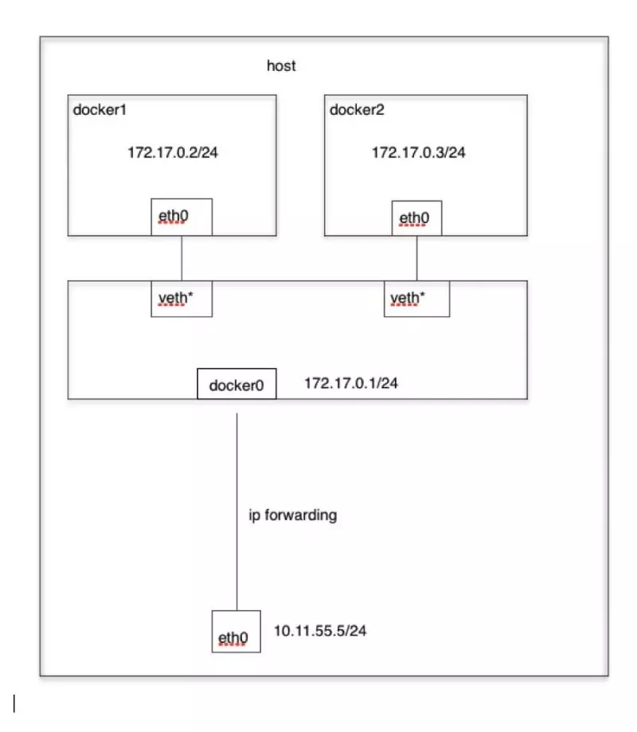
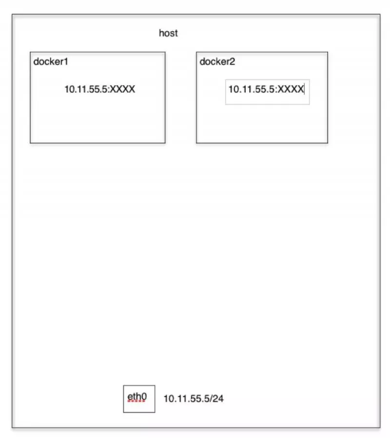
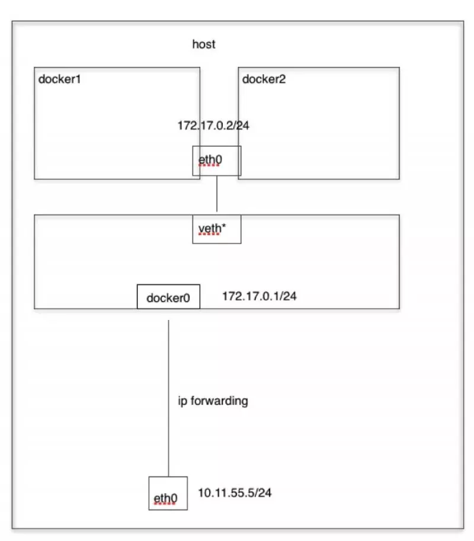
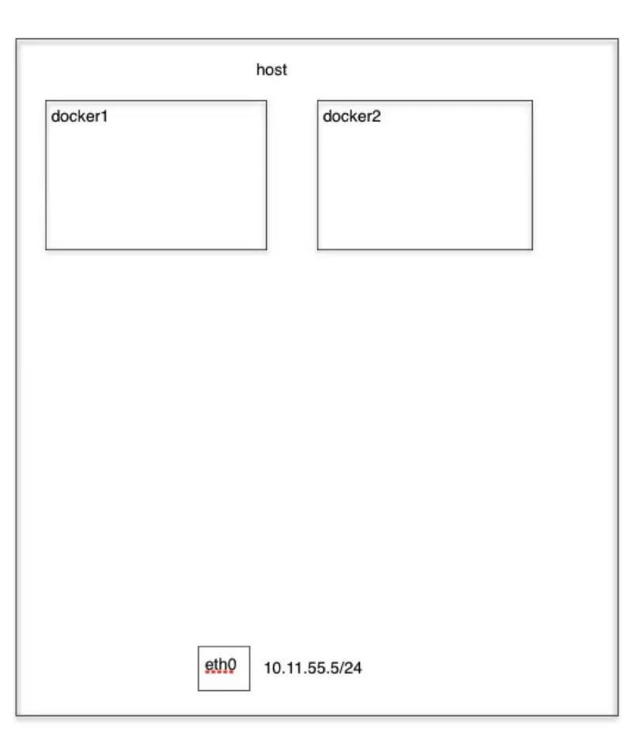

## 什么是Docker

+ Docker是一个容器化平台，它以容器的形式将您的应用程序及其所有依赖项打包在一起，以确保您的应用程序在开发，测试或生产的任何环境中无缝运行。
+ Docker容器，将一个软件包装在一个完整的文件系统中，该文件系统包含运行所需的一切：代码，运行时，系统工具，系统库等可以安装在服务器上的任何东西。
+ 这可以保证软件始终运行相同，无论其环境如何。


## 为什么要用Docker

+ 容器具有封闭性，在一个服务器里，可以有好多容器。每个容器他可以是系统，可以是服务、可以是应用，装着什么就是什么。
+ 程序性迁移。容器内的环境是可以与程序相适应。而这个容器又可以在不同的生产环境里使用。试使用一下，windows的游戏我就放到一个linux里面玩，宝马的外壳里面是奔驰，而且可以是很多台奔驰。
+ 速度快，定制快。持续交付与部署。（例如公司有多个项目，所使用的环境都好相似，由于客户不愿意给更多的钱购买专用的服务器，于是把这堆客户放在一个集群里面，共享他们的资源。)
+ 容器服务是在集群里的。这样服务器的横向扩展（随时增加ECS）和纵向扩展（升级ECS配置）都是很容易的事，无限的扩充。

## DOcker网络模式

[参考文章](https://juejin.im/post/5c3363bf6fb9a049e2322cdb)

可以使用`docker network ls`查看网络模式

+ Bridge contauner 桥接式网络模式 
+ Host(open) container   开放式网络模式 
+ Container(join) container   联合挂载式网络模式，是host网络模式的延伸 
+ None(Close) container   封闭式网络模式

### Bridge模式

当Docker进程启动时，会在**主机上创建一个名为docker0的虚拟网桥**，此主机上启动的Docker容器会连接到这个虚拟网桥上，所以有默认地址172.17.0.0/16的地址。虚拟网桥的工作方式和物理交换机类似，这样主机上的所有容器就通过交换机连在了一个二层网络中。　　

从**docker0子网中分配一个IP给容器使用**，并设置docker0的IP地址为容器的默认网关。在主机上创建一对虚拟网卡veth pair设备，Docker将veth pair设备的一端放在新创建的容器中，并命名为eth0（容器的网卡），另一端放在主机中，以vethxxx这样类似的名字命名，并将这个网络设备加入到docker0网桥中。可以通过brctl show命令查看。

```bash
[root@along ~]# brctl show
bridge name    bridge id        STP enabled    interfaces
docker0    8000.024241c45d6e    no
```

**bridge模式是docker的默认网络模式**，不写--net参数，就是bridge模式。使用docker run -p时，docker实际是在iptables做了DNAT规则，实现端口转发功能。可以使用`iptables -t nat -vnL`查看。

```bash
[root@along ~]# iptables -t nat -vnL
Chain POSTROUTING (policy ACCEPT 20 packets, 1238 bytes)
 pkts bytes target     prot opt in     out     source               destination         
    0     0 MASQUERADE  all  --  *      !docker0  172.17.0.0/16        0.0.0.0/0
```



### Host 网络模式

如果启动容器的时候使用host模式，那么这个容器将不会获得一个独立的**Network Namespace**，而是和宿主机共用一个Network Namespace。**容器将不会虚拟出自己的网卡，配置自己的IP等，而是使用宿主机的IP和端口。但是，容器的其他方面，如文件系统、进程列表等还是和宿主机隔离的。**



### Container 网络模式

这个模式指定**新创建的容器和已经存在的一个容器共享一个 Network Namespace，而不是和宿主机共享**。新创建的容器不会创建自己的网卡，配置自己的 IP，而是和一个指定的容器共享 IP、端口范围等。同样，两个容器除了网络方面，其他的如文件系统、进程列表等还是隔离的。两个容器的进程可以通过 lo 网卡设备通信。



### None 网络模式

使用none模式，**Docker容器拥有自己的Network Namespace，但是，并不为Docker容器进行任何网络配置。**也就是说，这个Docker容器没有网卡、IP、路由等信息，只有lo 网络接口。需要我们自己为Docker容器添加网卡、配置IP等。　　

不参与网络通信，运行于此类容器中的进程仅能访问本地回环接口；**仅适用于进程无须网络通信的场景中，例如：备份、进程诊断及各种离线任务等。**




## Docker与虚拟机的区别


Docker不是虚拟化方法。它依赖于实际实现基于容器的虚拟化或操作系统级虚拟化的其他工具。为此，Docker最初使用LXC驱动程序，然后移动到libcontainer现在重命名为runc。Docker主要专注于在应用程序容器内自动部署应用程序。应用程序容器旨在打包和运行单个服务，而系统容器则设计为运行多个进程，如虚拟机。因此，Docker被视为容器化系统上的容器管理或应用程序部署工具。

+ 与虚拟机不同，容器不需要引导操作系统内核，因此可以在不到一秒的时间内创建容器。此功能使基于容器的虚拟化比其他虚拟化方法更加独特和可取。
+ 由于基于容器的虚拟化为主机增加了很少或没有开销，因此基于容器的虚拟化具有接近本机的性能
+ 对于基于容器的虚拟化，与其他虚拟化不同，不需要其他软件。
+ 主机上的所有容器共享主机的调度程序，从而节省了额外资源的需求。
+ 与虚拟机映像相比，容器状态（Docker或LXC映像）的大小很小，因此容器映像很容易分发。
+ 容器中的资源管理是通过cgroup实现的。Cgroups不允许容器+ 消耗比分配给它们更多的资源。虽然主机的所有资源都在虚拟机中可见，但无法使用。这可以通过在容器和主机上同时运行top或htop来实现。所有环境的输出看起来都很相似。

## 容器内部机制

大约在2006年，包括Google的一些员工在内的人们实现了名为命名空间的新的Linux内核级功能（不过这个想法早在FreeBSD中就已存在）。操作系统的一个功能是允许将全局资源（如网络和磁盘）共享到进程。如果将这些全局资源包装在命名空间中，以使它们仅对在同一命名空间中运行的那些进程可见，该怎么办？比如说，你可以获得一大块磁盘并将其放在命名空间X中，然后在命名空间Y中运行的进程无法查看或访问它。类似地，名称空间X中的进程无法访问分配给名称空间Y的内存中的任何内容。当然，X中的进程无法查看或与名称空间Y中的进程通信。这为全局资源提供了一种虚拟化和隔离。

**这就是Docker的工作原理：每个容器都在自己的命名空间中运行，但使用与所有其他容器完全相同的内核。发生隔离是因为内核知道分配给进程的命名空间，并且在API调用期间确保进程只能访问其自己的命名空间中的资源。**

## 如何使用Docker构建与环境无关的系统？

+ Volumes
+ 环境变量注入
+ 只读文件系统

## 什么是Docker镜像？

**Docker镜像是Docker容器的源代码。**换句话说，Docker镜像用于创建容器。使用build命令创建映像，并且在使用run启动时它们将生成容器。镜像存储在Docker注册表http://registry.hub.docker.com中，因为它们可能变得非常大，镜像被设计为由其他镜像层组成，允许在通过网络传输镜像时发送最少量的数据。

## 什么是Docker容器？

**Docker容器包括应用程序及其所有依赖项，但与其他容器共享内核，作为主机操作系统上用户空间中的独立进程运行。**Docker容器不依赖于任何特定的基础架构：它们可以在任何计算机，任何基础架构和任何云中运行。

## 什么是Docker Hub？

Docker hub是一个基于云的注册表服务，允许您链接到代码存储库，构建镜像并测试它们，存储手动推送的镜像以及指向Docker云的链接，以便您可以将镜像部署到主机。它为整个开发流程中的容器镜像发现，分发和变更管理，用户和团队协作以及工作流自动化提供了集中资源。

## Docker容器有几种状态？

Docker容器可以有四种状态：

+ 运行
+ 已暂停
+ 重新启动
+ 已退出

可以通过`docker ps -a`查看容器状态


## 什么类型的应用程序 - 无状态或有状态更适合Docker容器？​​​​​​​

**最好为Docker Container创建无状态应用程序。**我们可以从应用程序中创建一个容器，并从应用程序中取出可配置的状态参数。现在我们可以在生产和具有不同参数的QA环境中运行相同的容器。这有助于在不同场景中重用相同的图像。使用Docker Containers比使用有状态应用程序更容易扩展无状态应用程序。


**解释基本的Docker使用流程**

+ 一切都从Dockerfile开始。Dockerfile是镜像的源代码。
+ 创建Dockerfile后，您可以构建它以创建容器的镜像。镜像只是“源代码”的“编译版本”，即Dockerfile。
+ 获得容器的镜像后，应使用注册表重新分发容器。注册表就像一个git存储库 - 你可以推送和拉取镜像。
+ 接下来，您可以使用该镜像来运行容器。在许多方面，正在运行的容器与虚拟机（但没有管理程序）非常相似。


## Dockerfile中最常见的指令是什么？​​​​​​​

Dockerfile中的一些常用指令如下：

+ FROM：我们使用FROM为后续指令设置基本镜像。在每个有效的Dockerfile中，FROM是第一条指令。
+ LABEL：我们使用LABEL按照项目，模块，许可等组织我们的镜像。我们也可以使用LABEL来帮助实现自动化。在LABEL中，我们指定一个键值对，以后可用于以编程方式处理Dockerfile。
+ RUN：我们使用RUN命令在当前镜像之上的新图层中执行任何指令。使用每个RUN命令，我们在镜像顶部添加一些内容，并在Dockerfile的后续步骤中使用它。
+ CMD：我们使用CMD命令提供执行容器的默认值。在Dockerfile中，如果我们包含多个CMD命令，则只使用最后一条指令。


## Dockerfile中的命令COPY和ADD命令有什么区别？

一般而言，虽然ADD并且COPY在功能上类似，但是**COPY是优选的**。

那是因为它比ADD更透明。

COPY仅支持将本地文件基本复制到容器中，而ADD具有一些功能（如仅限本地的tar提取和远程URL支持），这些功能并不是很明显。因此，ADD的最佳用途是将本地tar文件自动提取到镜像中，如ADD rootfs.tar.xz /中所示。

## 解释一下dockerfile的ONBUILD指令？

当镜像用作另一个镜像构建的基础时，ONBUILD指令向镜像添加将在稍后执行的触发指令。如果要构建将用作构建其他镜像的基础的镜像（例如，可以使用特定于用户的配置自定义的应用程序构建环境或守护程序），这将非常有用。

## Docker镜像和层有什么区别？

+ 镜像：Docker镜像是由一系列只读层构建的
+ 层：每个层代表镜像Dockerfile中的一条指令。

下面的Dockerfile包含四个命令，每个命令都创建一个层。
```dockerfile
FROM ubuntu:15.04
COPY . /app
RUN make /app
CMD python /app/app.py
```

重要的是，每个层只是与之前一层的一组差异层（相同的就不再放到新层中）。


## 什么是Docker Swarm？

**Docker Swarm是Docker的本机群集。**它将Docker主机池转变为单个虚拟Docker主机。Docker Swarm提供标准的Docker API，任何已经与Docker守护进程通信的工具都可以使用Swarm透明地扩展到多个主机。

## 如何在生产中监控Docker？

**Docker提供docker stats和docker事件等工具来监控生产中的Docker。**我们可以使用这些命令获取重要统计数据的报告。

+ Docker统计数据：当我们使用容器ID调用docker stats时，我们获得容器的CPU，内存使用情况等。它类似于Linux中的top命令。
+ Docker事件：Docker事件是一个命令，用于查看Docker守护程序中正在进行的活动流。
 一些常见的Docker事件是：attach，commit，die，detach，rename，destroy等。我们还可以使用各种选项来限制或过滤我们感兴趣的事件。


## Docker如何在非Linux系统中运行容器？

通过添加到Linux内核版本2.6.24的名称空间功能，可以实现容器的概念。容器将其ID添加到每个进程，并向每个系统调用添加新的访问控制检查。它由clone（）系统调用访问，该调用允许创建先前全局命名空间的单独实例。

如果由于Linux内核中可用的功能而可以使用容器，那么显而易见的问题是非Linux系统如何运行容器。Docker for Mac和Windows都使用Linux VM来运行容器。Docker Toolbox用于在Virtual Box VM中运行容器。但是，最新的Docker在Windows中使用Hyper-V，在Mac中使用Hypervisor.framework。

## 如何在多个环境中使用Docker？

可以进行以下更改：

+ 删除应用程序代码的任何卷绑定，以便代码保留在容器内，不能从外部更改
+ 绑定到主机上的不同端口
+ 以不同方式设置环境变量（例如，减少日志记录的详细程度，或启用电子邮件发送）
+ 指定重启策略（例如，重启：始终）以避免停​​机
+ 添加额外服务（例如，日志聚合器）

因此，您可能希望定义一个额外的Compose文件，例如production.yml，它指定适合生产的配置。此配置文件只需要包含您要从原始Compose文件中进行的更改。


## 为什么Docker Compose不会等待容器准备就绪，然后继续以依赖顺序启动下一个服务？

Compose按照依赖顺服启动和停止容器，决定依赖关系语句有 depends_on, links, volumes_from, 和network_mode: "service:...".

但是，对于启动，Compose不会等到容器“准备好它运行“。这里有一个很好的理由：

+ 等待数据库（例如）准备就绪的问题实际上只是分布式系统更大问题的一个子集。在生产中，您的数据库可能随时变得不可用或移动主机。您的应用程序需要能够适应这些类型的故障。
+ 要处理此问题，请将应用程序设计为在发生故障后尝试重新建立与数据库的连接。如果应用程序重试连接，它最终可以连接到数据库。
+ 最佳解决方案是在启动时以及出于任何原因丢失连接时，在应用程序代码中执行此检查。

## 如何批量删除或者停止运行的容器？
```bash
docker kill/rm `docker ps -aq`
```

## 本地的镜像文件都存放在哪里

Docker相关的本地资源存放在/var/lib/docker/目录下，其中container目录存放容器信息，graph目录存放镜像信息，aufs目录下存放具体的镜像底层文件。

## 构建Docker镜像应该遵循哪些原则？

整体远侧上，尽量保持镜像功能的明确和内容的精简，要点包括：

+ 尽量选取满足需求但较小的基础系统镜像，建议选择debian:wheezy镜像，仅有86MB大小
+ 清理编译生成文件、安装包的缓存等临时文件
+ 安装各个软件时候要指定准确的版本号，并避免引入不需要的依赖
+ 从安全的角度考虑，应用尽量使用系统的库和依赖
+ 使用Dockerfile创建镜像时候要添加.dockerignore文件或使用干净的工作目录

## 容器退出后，通过docker ps 命令查看不到，数据会丢失么？

容器退出后会处于终止（exited）状态，此时可以通过` docker ps -a `查看，其中数据不会丢失，还可以通过docker start 来启动，只有删除容器才会清除数据。

## 如何临时退出一个正在交互的容器的终端，而不终止它？

按Ctrl+p，后按Ctrl+q，如果按Ctrl+c会使容器内的应用进程终止，进而会使容器终止。


## 很多应用容器都是默认后台运行的，怎么查看它们的输出和日志信息？

使用docker logs，后面跟容器的名称或者ID信息

## 可以在一个容器中同时运行多个应用进程吗？

一般不推荐在同一个容器内运行多个应用进程，如果有类似需求，可以通过额外的进程管理机制，比如supervisord来管理所运行的进程。

## 如何控制容器占用系统资源（CPU，内存）的份额？

在使用docker create命令创建容器或使用docker run 创建并运行容器的时候，可以使用-c|–cpu-shares[=0]参数来调整同期使用CPU的权重，使用-m|–memory参数来调整容器使用内存的大小。

## 仓库（Repository）、注册服务器（Registry）、注册索引（Index）有何关系？

首先，仓库是存放一组关联镜像的集合，比如同一个应用的不同版本的镜像，注册服务器是存放实际的镜像的地方，注册索引则负责维护用户的账号，权限，搜索，标签等管理。注册服务器利用注册索引来实现认证等管理。

## 如何更改Docker的默认存储设置？

Docker的默认存放位置是/var/lib/docker,如果希望将Docker的本地文件存储到其他分区，可以使用Linux软连接的方式来做。

## 如何将一台宿主机的docker环境迁移到另外一台宿主机？

停止Docker服务，将整个docker存储文件复制到另外一台宿主机上，然后调整另外一台宿主机的配置即可

## 为什么要用Docker

+ 容器具有封闭性，在一个服务器里，可以有好多容器。每个容器他可以是系统，可以是服务、可以是应用，装着什么就是什么。
+ 程序性迁移。容器内的环境是可以与程序相适应。而这个容器又可以在不同的生产环境里使用。试使用一下，windows的游戏我就放到一个linux里面玩，宝马的外壳里面是奔驰，而且可以是很多台奔驰。
+ 速度快，定制快。持续交付与部署。（例如公司有多个项目，所使用的环境都好相似，由于客户不愿意给更多的钱购买专用的服务器，于是把这堆客户放在一个集群里面，共享他们的资源。)
+ 容器服务是在集群里的。这样服务器的横向扩展（随时增加ECS）和纵向扩展（升级ECS配置）都是很容易的事，无限的扩充。
