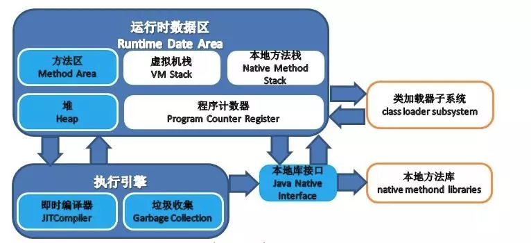
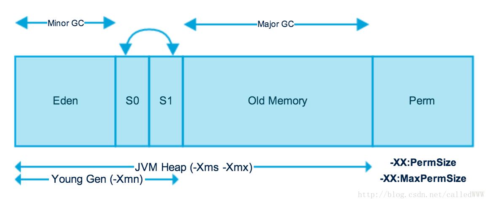

## JVM

JVM即java虚拟机，可以屏蔽具体硬件平台执行java语言或其他jvm支持的语言编译而出的字节码，**jvm实现了java语言重要的特征：平台无关性，一次编译到处运行。** 

原理：编译后的java程序指令并不是直接在CPU上执行，而是由JVM执行。JVM屏蔽了具体的硬件平台，使Java语言只需要编译生成在JVM上运行的目标字节码(.class)，就可以不加修改的在各个平台上执行。

**JVM=类加载器+执行引擎+运行时数据区域**

## JVM: 类加载机制

Java虚拟机把描述类的数据从Class文件加载到内存，并对数据进行校验、转换解析和初始化，最终形成可以被虚拟机直接使用的Java类型，这就是**虚拟机的加载机制**。

[要看看哦](https://juejin.im/post/5a810b0e5188257a5c606a85#heading-1)
<!--more-->
### 类加载时机

类从被虚拟机加载到内存中开始，到卸载出内存为止，它的生命周期经历了**加载（Loading）、验证（Verification）、准备（Preparation）、解析（Resolution）、初始化（Initialization）、使用（Using）和卸载（Unloading）**，一共七个阶段，其中验证、准备、解析部分统称为连接。

**加载、验证、准备、初始化这个5个阶段的顺序是固定的**，也就是说类的加载过程必须按照这种顺序按部就班开始；**解析阶段则不一定，解析阶段的工作完全可能在初始化之后才开始**，之所以这么设计，就是为了**支持Java语言的动态绑定**。还有一点需要注意的是，虽然上述的5个阶段可能按照顺序开始，但是并不是说一个接一个阶段完成后才开始，一个阶段的进行完全可能激活另一个阶段的进行，**交叉混合式**的进行。

#### 何时类开始加载

那么什么情况下需要开始类加载过程的第一个阶段，加载到内存中呢？这就不得不涉及两个概念：**主动引用和被动引用**。

**根据Java虚拟机的规范，只有5中情况属于主动引用：**

+ 遇到new（使用new 关键字实例化一个对象）、getstatic（读取一个类的静态字段）、putstatic或者invokestatic（设置一个类的静态字段）这4条指令的时候，如果累没有进行过初始化。则需要先触发其初始化。
+ 使用反射进行反射调用的时候，如果类没有初始化，则需要先触发其初始化。
+ 当初始化一个类的时候，如果其父类没有初始化，则需要先触发其父类的初始化
+ 程序启动需要触发main方法的时候，虚拟机会先触发这个类的初始化
+ 当使用jdk1.7的动态语言支持的时候，如果一个java.lang.invoke.MethodHandler实例最后的解析结果为REF_getStatic、REF_pusStatic、REF_invokeStatic的方法句柄（句柄中包含了对象的实例数据和类型数据，句柄是访问对象的一种方法。句柄存储在堆中），并且句柄对应的类没有被初始化，那么需要先触发这个类的初始化。

**5种之外情况就是被动引用。被动引用的经典例子有：**

+ 通过子类引用父类的静态字段
 这种情况不会导致子类的初始化，因为对于静态字段，只有直接定义静态字段的类才会被触发初始化，子类不是定义这个静态字段的类，自然不能被实例化。
+ 通过数组定义来引用类，不会触发该类的初始化
 例如， Clazz[] arr = new Clazz[10];并不会触发。
+ 常量不会触发定义常量的类的初始化
 因为常量在编译阶段会存入调用常量的类的常量池中，本质上并没有引用定义这个常量的类，所以不会触发定义这个常量的类的初始化。

### 类加载过程

#### 加载

在加载阶段虚拟机需要完成以下三件事：

+ 通过一个类的全限定名称来获取此类的二进制字节流
+ 将这个字节流所代表的静态存储结构转化为方法区的运行时数据结构
+ 在内存中生成一个代表这个类的java.lang.Class对象，作为方法区这个类的各种数据的访问入口

这三件事在Java虚拟机中并没有说的很详细，比如类的全限定名称是如何加载进来的，以及从哪里加载进来的。通常来讲，一个类的全限定名称可以从zip、jar包中加载，也可以从网络中获取，也可以在运行的时候生成（这点最明显的技术体现就是反射机制）。

对于类的加载，可以分为数组类型和非数组类型，**对于非数组类型可以通过系统的引导类加载器进行加载，也可以通过自定义的类加载器进行加载**。这点是比较灵活的。而对于**数组类型，数组类本身不通过类加载器进行加载，而是通过Java虚拟机直接进行加载的**，那么是不是数组类型的类就不需要类加载器了呢？答案是否定的。因为当数组去除所有维度之后的类型最终还是要依靠类加载器进行加载的，所以数组类型的类与类加载器的关系还是很密切的。

通常一个**数组类型的类**进行加载需要遵循以下的原则：

+ 如果数组的组件类型（也就是数组类去除一个维度之后的类型，比如对于二维数组，去除一个维度之后是一个一维数组）是引用类型，那么递归采用上面的过程加载这个组件类型
+ 如果数组类的组件类型不是引用类型，比如是基本数据类型，Java虚拟机将把数组类标记为与引导类加载器关联

数组类的可见性与组件类型的可见性是一致的。如果组件类型不是引用类型，那么数组类的可见性是public，意味着组件类型的可见性也是public。

前面已经介绍过，**加载阶段与连接阶段是交叉进行的，所以可能加载阶段还没有完成，连接阶段就已经开始**。但是即便如此，记载阶段与连接阶段之间的开始顺序仍然保持着固定的顺序。

### 验证

**验证阶段的目的是为了确保Class字节流中包含的信息符合当前虚拟机的要求，并且不会危害虚拟机的安全。**

我们知道Java语言具有相对的安全性（这里的安全性体现为两个方面：**一是Java语言本身特性，比如Java去除指针，这点可以避免对内存的直接操作；二是Java所提供的沙箱运行机制，Java保证所运行的机制都是在沙箱之内运行的，而沙箱之外的操作都不可以运行**）。但是需要注意的是JVM处理的Class文件并不一定是是从Java代码编译而来，完全可能是来自其他的语言，甚至可以直接通过十六进制编辑器书写Class文件（当然前提是编写的Class文件符合规范）。从这个角度讲，其他来源的Class文件是不可能都保证其安全性的。所以如果Java虚拟机都信任其加载进来的Class文件，那么很有可能会造成对虚拟机自身的危害。

虚拟机的验证阶段主要完后以下4项验证：**文件格式验证、元数据验证、字节码验证、符号引用验证**。

#### 文件格式验证

这里的文件格式是指Class的文件规范，这一步的验证主要保证加载的字节流（在计算机中不可能是整个Class文件，只有0和1，也就是字节流）符合Class文件的规范（根据前面对Class类文件的描述，Class文件的每一个字节表示的含义都是确定的。比如前四个字节是否是一个魔数等）以及保证这个字节流可以被虚拟机接受处理。

在Hotspot的规范中，对文件格式的验证远不止这些，但是只有通过文件格式的验证才能进入方法区中进行存储。所以自然也就知道，后面阶段的验证工作都是在方法区中进行的。

#### 元数据验证

元数据可以理解为描述数据的数据，更通俗的说，元数据是描述类之间的依赖关系的数据，比如Java语言中的注解使用（使用@interface创建一个注解）。元数据验证主要目的是对类的元数据信息进行语义校验，保证不存在不符合Java语言规范（Java语法）的元数据信息。

具体的验证信息包括以下几个方面：

+ 这个类是否有父类（除了java.lang.Object外其余的类都应该有父类）
+ 这个类的父类是否继承了不允许被继承的类（比如被final修饰的类）
+ 如果这个类不是抽象类，是否实现了其父类或者接口中要求实现的方法
+ 类中的字段、方法是否与父类产生矛盾（比如是否覆盖了父类的final字段）

#### 字节码验证

这个阶段主要对类的方法体进行校验分析。通过了字节码的验证并不代表就是没有问题的，但是如果没有通过验证就一定是有问题的。整个字节码的验证过程比这个复杂的多，由于字节码验证的高度复杂性，在jdk1.6版本之后的虚拟机增加了一项优化，Class类文件结构这篇文章中说到过有一个属性：StackMapTable属性。可以简单理解这个属性是用于检查类型是否匹配。

#### 符号引用验证

这个验证是最后阶段的验证，符号引用是Class文件的逻辑符号，直接引用指向的方法区中某一个地址，在解析阶段，将符号引用转为直接引用，这里只进行转化前的匹配性校验。符号引用验证主要是对类自身以外的信息进行匹配性校验。比如符号引用是否通过字符串描述的全限定名是否能够找到对应点类。

##### 符号引用（Symbolic Reference）

符号引用以一组符号来描述所引用的目标，符号引用可以是任何形式的字面量，只要使用时能无歧义的定位到目标即可（符号字面量，还没有涉及到内存）。符号引用与虚拟机实现的内存布局无关，引用的目标并不一定已经加载在内存中。各种虚拟机实现的内存布局可以各不相同，但是他们能接受的符号引用必须都是一致的，因为符号引用的字面量形式明确定义在Java虚拟机规范的Class文件格式中。

##### 直接引用（Direct Reference）

直接引用可以是直接指向目标的指针、相对偏移量或是一个能间接定位到目标的句柄（可以理解为内存地址）。直接引用是与虚拟机实现的内存布局相关的，同一个符号引用在不同的虚拟机实例上翻译出来的直接引用一般都不相同，如果有了直接引用，那引用的目标必定已经在内存中存在。

**进行符号引用验证的目的在于确保解析动作能够正常执行**，如果无法通过符号引用验证那么将会抛出java.lang.IncomingChangeError异常的子类。

### 准备

完成了验证阶段之后，就进入准备阶段。准备阶段是正式为变量分配内存空间并且设置类变量初始值。

需要注意的是，这时候进行内存分配的仅仅是类变量（也就是被static修饰的变量），实例变量是不包括的，实例变量的初始化是在对象实例化的时候进行初始化，而且分配的内存区域是Java堆。这里的初始值也就是在编程中默认值，也就是零值。

例如public static int value = 123 ；value在准备阶段后的初始值是0而不是123，因为此时尚未执行任何的Java方法，而把value赋值为123的putStatic指令是程序被编译后，存放在类构造器clinit()方法之中，把value赋值为123的动作将在初始化阶段才会执行。

特殊情况：如果类字段的字段属性表中存在ConstantValue属性，那在准备阶段变量就会被初始化为ConstantValue属性所指定的值，例如public static final int value = 123 编译时javac将会为value生成ConstantValue属性，在准备阶段虚拟机就会根据ConstantValue的设置将变量赋值为123。

### 解析

**解析阶段是将常量池中的符号引用替换为直接引用的过程**。在进行解析之前需要对符号引用进行解析，不同虚拟机实现可以根据需要判断到底是在类被加载器加载的时候对常量池的符号引用进行解析（也就是初始化之前），还是等到一个符号引用被使用之前进行解析（也就是在初始化之后）。

到现在我们已经明白解析阶段的时机，那么还有一个问题是：**如果一个符号引用进行多次解析请求，虚拟机中除了invokedynamic指令外，虚拟机可以对第一次解析的结果进行缓存（在运行时常量池中记录引用，并把常量标识为一解析状态），这样就避免了一个符号引用的多次解析。**

**解析动作主要针对的是类或者接口、字段、类方法、方法类型、方法句柄和调用点限定符7类符号引用**。这里主要说明前四种的解析过程。

#### 类或者接口解析

要把一个类或者接口的符号引用解析为直接引用，需要以下三个步骤：

+ 如果该符号引用不是一个数组类型，那么虚拟机将会把该符号代表的全限定名称传递给调用这个符号引用的类。这个过程由于涉及验证过程所以可能会触发其他相关类的加载
+ 如果该符号引用是一个数组类型，并且该数组的元素类型是对象。我们知道符号引用是存在方法区的常量池中的，该符号引用的描述符会类似”[java/lang/Integer”的形式（描述符的概念详见前文【深入理解JVM】：Class类文件结构），将会按照上面的规则进行加载，虚拟机将会生成一个代表此数组对象的直接引用
+ 如果上面的步骤都没有出现异常，那么该符号引用已经在虚拟机中产生了一个直接引用，但是在解析完成之前需要对符号引用进行验证，主要是确认当前调用这个符号引用的类是否具有访问权限，如果没有访问权限将抛出java.lang.IllegalAccess异常

#### 字段解析

对字段的解析需要首先对其所属的类进行解析，因为字段是属于类的，只有在正确解析得到其类的正确的直接引用才能继续对字段的解析。对字段的解析主要包括以下几个步骤：

+ 如果该字段符号引用（后面简称符号）就包含了简单名称和字段描述符都与目标相匹配的字段，则返回这个字段的直接引用，解析结束
+ 否则，如果在该符号的类实现了接口，将会按照继承关系从下往上递归搜索各个接口和它的父接口，如果在接口中包含了简单名称和字段描述符都与目标相匹配的字段，那么久直接返回这个字段的直接引用，解析结束
+ 否则，如果该符号所在的类不是Object类的话，将会按照继承关系从下往上递归搜索其父类，如果在父类中包含了简单名称和字段描述符都相匹配的字段，那么直接返回这个字段的直接引用，解析结束
+ 否则，解析失败，抛出java.lang.NoSuchFieldError异常
如果最终返回了这个字段的直接引用，就进行权限验证，如果发现不具备对字段的访问权限，将抛出java.lang.IllegalAccessError异常

#### 类方法解析

进行类方法的解析仍然需要先解析此类方法的类，在正确解析之后需要进行如下的步骤：

类方法和接口方法的符号引用是分开的，所以如果在类方法表中发现class_index（类中方法的符号引用）的索引是一个接口，那么会抛出java.lang.IncompatibleClassChangeError的异常

+ 如果class_index的索引确实是一个类，那么在该类中查找是否有简单名称和描述符都与目标字段相匹配的方法，如果有的话就返回这个方法的直接引用，查找结束
+ 否则，在该类的父类中递归查找是否具有简单名称和描述符都与目标字段相匹配的字段，如果有，则直接返回这个字段的直接引用，查找结束
+ 否则，在这个类的接口以及它的父接口中递归查找，如果找到的话就说明这个方法是一个抽象类，查找结束，返回java.lang.AbstractMethodError异常（因为抽象类是没有实现的）
+ 否则，查找失败，抛出java.lang.NoSuchMethodError异常
如果最终返回了直接引用，还需要对该符号引用进行权限验证，如果没有访问权限，就抛出java.lang.IllegalAccessError异常

#### 接口方法解析

同类方法解析一样，也需要先解析出该方法的类或者接口的符号引用，如果解析成功，就进行下面的解析工作：

如果在接口方法表中发现class_index的索引是一个类而不是一个接口，那么也会抛出java.lang.IncompatibleClassChangeError的异常

否则，在该接口方法的所属的接口中查找是否具有简单名称和描述符都与目标字段相匹配的方法，如果有的话就直接返回这个方法的直接引用。查找结束

否则，在该接口以及其父接口中查找，直到Object类，如果找到则直接返回这个方法的直接引用
否则，查找失败

接口的所有方法都是public，所以不存在访问权限问题

### 初始化

**到了初始化阶段，虚拟机才开始真正执行Java程序代码**，前文讲到对类变量的初始化，但那是仅仅赋初值，用户自定义的值还没有赋给该变量。只有到了初始化阶段，才开始真正执行这个自定义的过程，所以也可以说初始化阶段是执行类构造器方法clinit() 的过程。那么这个clinit() 方法是这么生成的呢？

clinit() 是编译器自动收集类中所有类变量的赋值动作和静态语句块合并生成的。编译器收集的顺序是由语句在源文件中出现的顺序决定的。静态语句块中只能访问到定义在静态语句块之前的变量，定义在它之后的变量，在前面的静态语句块可以赋值，但是不能访问。
示例代码：
```java
public class Test {
    static{
        i =0;          //给变量赋值可以正常编译通过
        System.out.println(i);  //这句编译器会提示“非法向前引用”
    }
    static int i = 1;
}
```

clinit() 方法与类的构造器方法不同，因为前者不需要显式调用父类构造器，因为虚拟机会保证在子类的clinit() 方法执行之前，父类的clinit() 方法已经执行完毕

由于父类的clinit() 方法会先执行，所以就表示父类的static方法会先于子类的clinit() 方法执行。如下面的例子所示，输出结果为2而不是1。

```java
public class Parent {  
    public static int A = 1;  
    static{  
       A = 2;  
    }  
}    

public class Sub extends Parent{  
    public static int B = A;  
}   

public class Test {  
    public static void main(String[] args) {  
       System.out.println(Sub.B);  
    }  
}
```

clinit()方法对于类或者接口来说并不是必需的，如果一个类中没有静态语句块也没有对变量的赋值操作，那么编译器可以不为这个类生成clinit()方法。

接口中不能使用静态语句块，但仍然有变量赋值的初始化操作，因此接口也会生成clinit()方法。但是接口与类不同，执行接口的clinit()方法不需要先执行父接口的clini>()方法。只有当父接口中定义的变量被使用时，父接口才会被初始化。另外，接口的实现类在初始化时也不会执行接口的clinit()方法。

虚拟机会保证一个类的clinit()方法在多线程环境中被正确地加锁和同步。如果有多个线程去同时初始化一个类，那么只会有一个线程去执行这个类的clinit()方法，其它线程都需要阻塞等待，直到活动线程执行clinit()方法完毕。如果在一个类的clinit()方法中有耗时很长的操作，那么就可能造成多个进程阻塞。


## JVM双亲委派机制

[参考文章](https://blog.csdn.net/u011080472/article/details/51332866)

Java虚拟机中的一个类由其类加载器和二进制字节流class文件唯一确定。

> 什么是JVM双亲委派机制？

所谓双亲委派机制是Java推荐的类加载机制，其实现流程就是当需要加载一个类的时候，首先将该加载需求委托给父类加载器，如果父类不能完成类加载，则再调用子类加载器。

类加载器的继承关系：

启动类加载器<-扩展类记载器<-应用/系统类加载器<-用户自定义类加载器

> 为什么需要双亲委派模型？

举个例子来说明，例如`java.lang.Object`类在`rt.jar`中，是由启动类加载器加载，在双亲委派机制下，无论哪个类加载器要加载该类，最终都会委托给启动类加载器来加载，因此得到都是同一个类。相反，如果没有双亲委派机制，开发者在自己的classpath下定义一个`Object`类，并由自己的类加载器或者应用类加载器加载，得到是不同的`Object`类，程序就会存在好几个`Object`类，导致程序混乱。

> 什么时候需要破坏双亲委派机制？

JNDI服务：JNDI的目的就是对资源进行集中管理和查找，它需要调用独立厂商实现部部署在应用程序的classpath下的JNDI接口提供者(SPI, Service Provider Interface)的代码。

因此，为了破坏这种双亲委派机制，在**启动类里也能够使用系统类加载器对类进行加载**，Java设计了**线程上下文加载器**。在核心类进行类加载时，可以读取当前线程的线程上下文加载器，使用该加载器加载实现了SPI接口的类。

Java中所有涉及SPI的加载动作基本上都采用这种方式，例如JNDI,JDBC,JCE,JAXB和JBI等


## 对象实例化过程：

+ 当JVM遇到字节码new指令时，首先检查该指令参数能否在常量池中定位到一个具体的类的符号引用，并检查该类
是否经过加载、验证、解析和初始化，如果没有则进行类加载
+ 虚拟机在堆区分配空间
+ 分配空间完成后，虚拟机为对象成员变量赋零值，这样可以保证对象不赋初值也可以调用。
+ 设置对象头，包括哈希值、GC信息、锁信息、对象所属类的类元信息
+ 执行init方法，初始化成员变量，执行实例化代码块，调用类的构造方法，**并把堆内对象的首地址赋值给引用变量**。

## 对象分配内存是否线程安全

对象创建十分频繁，即使修改一个指针的位置在并发下也不是线程安全的，可能正给对象A分配内存，指针还没来得及修改，对象B又使用了指针来分配内存。

解决方法：① CAS 加失败重试保证更新原子性。② 把内存分配按线程划分在不同空间，即每个线程在 Java 堆中预先分配一小块内存，叫做本地线程分配缓冲TLAB(Thread Local Allocation Buffer)，哪个线程要分配内存就在对应的TLAB分配，TLAB用完了再进行同步

## 对象的内存布局了解吗？

对象在堆内存的存储布局可分为**对象头、实例数据和对齐填充**。

**对象头占12B**，包括对象标记和类型指针。对象标记存储对象自身的运行时数据，如哈希码、GC 分代年龄、锁标志、偏向线程 ID 等，这部分占 8B，称为 Mark Word。Mark Word 被设计为动态数据结构，以便在极小的空间存储更多数据，根据对象状态复用存储空间。

**类型指针是对象指向它的类型元数据的指针**，占 4B。JVM 通过该指针来确定对象是哪个类的实例。

**实例数据是对象真正存储的有效信息，即本类对象的实例成员变量和所有可见的父类成员变量**。存储顺序会受到虚拟机分配策略参数和字段在源码中定义顺序的影响。相同宽度的字段总是被分配到一起存放，在满足该前提条件的情况下父类中定义的变量会出现在子类之前。

**对齐填充不是必然存在的，仅起占位符作用。**虚拟机的自动内存管理系统要求任何对象的大小必须是 8B 的倍数，对象头已被设为 8B 的 1 或 2 倍，如果对象实例数据部分没有对齐，需要对齐填充补全。

## JVM 运行时数据区

JVM = 类加载器(classloader) + 执行引擎(execution engine) + 运行时数据区域(runtime data area)



### 栈区：栈区需要内存连续，线程私有，可以避免GC

 + 程序计数器：记录正在执行的虚拟机字节码指令地址(如果是本地方法则为空)

 + Java虚拟机栈：每一个Java方法在执行的同时会创建一个栈帧用于存放**局部变量表、操作数栈、常量池引用**等信息，方法的调用直至执行完成对应着栈帧入栈和出栈过程。

    - 可以通过`-Xss`这个参数来描述Java虚拟机栈的内存大小，JDK1.4默认256k，而JDK1.5+默认为1M
    ```
    java -Xss2M HackTheJava
    ```

    - 该区域可能抛出如下异常：

        + 线程请求的栈深度超过最大值，抛出`StackOverflowError`

        + 栈进行动态扩展时无法申请到足够内存时，抛出`OutOfMemoryError`

+ 本地方法栈：本地方法栈与 Java 虚拟机栈类似，它们之间的区别只不过是本地方法栈为本地方法服务。

本地方法一般是用其它语言（C、C++ 或汇编语言等）编写的，并且被编译为基于本机硬件和操作系统的程序，对待这些方法需要特别处理。

### 堆区：堆区不需要连续的内存，可动态增加内存，增加内存失败会抛出`OutOfMemoryError`



被**所有线程共享**，在虚拟机启动时创建，用来存放对象实例，**几乎所有的对象实例都在这里分配内存**。

对于大多数应用来说，Java堆（Java Heap）是Java虚拟机所管理的内存中最大的一块。
        
**Java堆是垃圾收集器管理的主要区域，因此很多时候也被称做“GC堆”。**

如果从内存回收的角度看，由于现在收集器基本都是采用的分代收集算法，所以Java堆中还可以细分为：**新生代和老年代；新生代又有Eden空间、From Survivor空间、To Survivor空间三部分。**
        
**Java 堆不需要连续内存，并且可以通过动态增加其内存，增加失败会抛出 OutOfMemoryError 异常。**


现在的垃圾收集器都采用分代收集算法，其主要思想采用不同类型的对象采用不同的垃圾收集算法，可以将堆分成两块：

+ 新生代
+ 老年代

可以通过 `-Xms` 和 `-Xmx` 这两个虚拟机参数来指定一个程序的堆内存大小，第一个参数设置初始值，第二个参数设置最大值。

```
java -Xms1M -Xmx2M HackTheJava
```

#### 新生代：
+ 大多数新生的对象在Eden区分配，**当Eden区没有足够空间进行分配时，虚拟机就会进行一次MinorGC。**
+ 在方法中new一个对象，方法调用完毕，对象就无用，这就是典型的新生代对象。（新生对象在Eden区经历过一次MinorGC并且Survivor容纳的话，对象年龄为1，并且每熬过一次MinorGC，年龄就会加1，直到15，就会晋升到老年代）
+ 注意动态对象的判定：Survivor空间中相同年龄的对象大小总和大于Survivor空间的一半，大于或者等于该年龄的对象就可以直接进入老年代。

#### 老年代：
+ 在新生代中经历了N次垃圾回收后仍然存活的对象，就会被放到老年代中，而且大对象（占用大量连续内存空间的java对象如很长的字符串及数组）直接进入老年代。
+ 当survivor空间不够用时，需要依赖老年代进行分配担保。

#### 永久代：

+ 方法区
+ 主要存放Class和Meta的信息，Class在被加载的时候被放入永久代。它和存放对象的堆区域不同，GC(Garbage Collection)不会在主程序运行期对永久代进行清理，所以如果你的应用程序会加载很多Class的话,就很可能出现PermGen space错误。


### 方法区

用于存放**已被加载的类信息、常量、静态变量、即时编译器编译后的代码**等数据。

和**堆一样不需要连续的内存**，并且可以动态扩展，动态扩展失败一样会抛出 `OutOfMemoryError` 异常。

对这块区域进行垃圾回收的主要目标是对常量池的回收和对类的卸载，但是一般比较难实现。

HotSpot虚拟机把它当成永久代来进行垃圾回收。但很难确定永久代的大小，因为它受到很多因素影响，并且每次 Full GC 之后永久代的大小都会改变，所以经常会抛出`OutOfMemoryError`异常。为了更容易管理方法区，从 JDK 1.8 开始，移除永久代，并把方法区移至元空间(metaspace)，它位于本地内存中，而不是虚拟机内存中。

方法区是一个JVM规范，永久代与元空间都是其一种实现方式。在 JDK 1.8 之后，原来永久代的数据被分到了堆和元空间中。元空间存储类的元信息，静态变量和常量池等放入堆中。

  + 运行时常量池

    **运行时常量池是方法区的一部分**。

    Class 文件中的常量池（编译器生成的字面量和符号引用）会在类加载后被放入这个区域。

    除了在编译期生成的常量，还允许动态生成，例如 String 类的 intern()。

### 直接内存

在 JDK 1.4 中新引入了 NIO 类，它可以使用 Native 函数库直接分配堆外内存，然后通过 Java 堆里的 DirectByteBuffer 对象作为这块内存的引用进行操作。这样能在一些场景中显著提高性能，因为避免了在堆内存和堆外内存来回拷贝数据。

## JVM: 常见GC算法

### GC分类
+ MinorGC：是指清理新生代 **当Eden区满时，触发Minor GC。**
+ MajorGC：是指清理老年代（很多MajorGC是由MinorGC触发的）
+ FullGC：是指清理整个堆空间包括年轻代和永久代

### MinorGC与FullGC触发条件

+ Minor GC触发条件：当Eden区满时，触发Minor GC。
+ Full GC触发条件：
  - （1）调用System.gc时，系统建议执行Full GC，但是不必然执行
  - （2）老年代空间不足
  - （3）方法区空间不足
  - （4）通过Minor GC后进入老年代的平均大小大于老年代的可用内存
  - （5）由Eden区、From Space区向To Space区复制时，对象大小大于To Space可用内存，则把该对象转存到老年代，且老年代的可用内存小于该对象大小

### Java四种引用类型

```java
Object ref=new Object();//ref是Object对象的强引用

//将一个软引用指向Object对象，此时Object对象有两个引用
SoftReference<Object> sf=new SoftReference<Object>(ref);

ref=null;//移除强引用

Object object=ref.get();//获取目标对象

System.gc();//gc只有在内存不足时才会移除软引用对象
```

引用类型|取得目标方法|垃圾回收条件|是否可能内存泄漏
----|----|----|----
强引用|直接调用|不回收|可能
软引用|get()|视内存情况|不可能
弱引用|get()|gc即回收|不可能
虚引用|无法取得|不回收|可能

[不记得时，就看看吧](https://zhang0peter.com/2020/02/13/java-gc/)

### 标记算法

+ 引用计数法
  
  通过在对象中分配一个字段用来存储对象引用计数，一旦对象被引用，则引用计数加一，引用失效则减一，一旦引用计数为0，可以被回收

  - 优点：实现简单，过程高效，具有实时性

  - 缺点：需要额外资源维护，且无法解决对象循环依赖问题(Python中解决方法是采用标记-清除算法)

+ 可达性分析法
  
  维护一系列`GC Root`对象作为根，当一个对象经过引用链到达根节点时没有任何引用，则表明该对象不可用，可以被GC回收。

  **可以当作`GC Root`的对象包括但不限于:**

   - 1.虚拟机栈（栈帧中的本地变量表）中引用的对象；// 方法中的局部变量
   - 2.方法区中的类静态属性引用的对象；
   - 3.方法区中常量引用的对象；
   - 4.本地方法栈中JNI（即一般说的Native方法）中引用的对象
  
  需要注意的是，在可达性分析算法中被判定不可达的对象还未真的判『死刑』，至少要经历两次标记过程：判断对象是否有必要执行finalize()方法；若被判定为有必要执行finalize()方法，之后还会对对象再进行一次筛选，如果对象能在finalize()中重新与引用链上的任何一个对象建立关联，将被移除出“即将回收”的集合。

### 回收算法

+ 标记清除算法: 会产生空间碎片，当出现连续空间不足够时，虚拟机会感知内存不足，则再次触发GC，而且标记清除算法效率不高，会导致GC时间占用过多，影响程序运行。
+ 复制算法：以空间换时间的算法，每次只用一半空间，且不存在空间碎片。在虚拟机内存的新生代中，大批对象死去只保留少数对象，因此适用于复制算法。
+ 标记整理算法：是在标记清除算法基础上加上对象移动这个整理过程，从而解决了空间碎片问题，但效率比标记清除还低，适用于老年代。
+ 分代收集算法

    从上面三种 GC 算法可以看到，并没有一种空间与时间效率都是比较完美的算法，所以只能做的是综合利用各种算法特点将其作用到不用的内存区域。

    js的V8引擎，Python, HotSpot 都采用了分代收集算法。

    目前JVM虚拟机根据对象存活周期不同划分内存区域，一般分为新生代，老年代。新对象一般情况都会优先分配在新生代，新生代对象若存活时间大于一定阈值之后，将会移到至老年代。新生代的对象都是存活时间短，老年代的对象存活时间长。

    新生代每次 GC 之后都可以回收大批量对象，所以比较适合复制算法，只需要付出少量复制存活对象的成本。这里内存划分并没有按照 1:1 划分，默认将会按照 8:1:1 划分成 Eden 与两块 Survivor 空间。每次使用 Eden 与一块 Survivor 空间，这样我们只是闲置 10% 内存空间。不过我们每次回收并不能保证存活对象小于 10%,在这种情况下就需要依靠老年代的内存分配担保。当 Survivor 空间并不能保存剩余存活对象，就将这些对象通过分配担保进制移动至老年代。

    老年代中对象存活率将会特别高，且没有额外空间进行分配担保，所以并不适合复制算法，所以需要使用标记-清除或标记-整理算法。

    大多数情况下，新的对象都分配在Eden区，当 Eden 区没有空间进行分配时，将进行一次 Minor GC，清理 Eden 区中的无用对象。清理后，Eden 和 From Survivor 中的存活对象如果小于To Survivor 的可用空间则进入To Survivor，否则直接进入老年代；Eden 和 From Survivor 中还存活且能够进入 To Survivor 的对象年龄增加 1 岁（虚拟机为每个对象定义了一个年龄计数器，每执行一次 Minor GC 年龄加 1），当存活对象的年龄到达一定程度（默认 15 岁）后进入老年代，可以通过 -XX:MaxTenuringThreshold 来设置年龄的值。

    当进行了 Minor GC 后，Eden 还不足以为新对象分配空间（那这个新对象肯定很大），新对象直接进入老年代。

    占 To Survivor 空间一半以上且年龄相等的对象，大于等于该年龄的对象直接进入老年代，比如 Survivor 空间是 10M，有几个年龄为 4 的对象占用总空间已经超过 5M，则年龄大于等于 4 的对象都直接进入老年代，不需要等到 MaxTenuringThreshold 指定的岁数。

    在进行 Minor GC 之前，会判断老年代最大连续可用空间是否大于新生代所有对象总空间，如果大于，说明 Minor GC 是安全的，否则会判断是否允许担保失败，如果允许，判断老年代最大连续可用空间是否大于历次晋升到老年代的对象的平均大小，如果大于，则执行 Minor GC，否则执行 Full GC。

    大对象（需要大量连续内存的对象）例如很长的数组，会直接进入老年代，如果老年代没有足够的连续大空间来存放，则会进行 Full GC。

## JVM GC收集器特点

[参考文章](https://crowhawk.github.io/2017/08/15/jvm_3/)

### 新生代收集器

收集器名称|垃圾回收算法|特点
----|----|----
Serial|复制算法| + HotSpot虚拟机运行在Client模式下的默认的新生代收集器<br> + 会暂停所有用户线程(stop the world)<br> + 简单而高效（与其他收集器的单线程相比），对于限定单个CPU的环境来说，Serial收集器由于没有线程交互的开销，专心做垃圾收集自然可以获得更高的单线程收集效率。
Parnew|复制算法| + 是Serial收集器的多线程版本<br> + 同样会暂停所有用户线程<br> + Server模式下首选的虚拟机新生代收集器<br> + 多CPU下性能会优于Serial收集器<br> + 只有Serial和Parnew能和CMS（Concurrent Mark Sweep收集器配合
Parallel Scavenge|复制算法|+ 并行的多线程新生代GC收集器<br> + CMS等收集器的关注点是尽可能缩短垃圾收集时用户线程的停顿时间，而Parallel Scavenge收集器的目标是达到一个可控制的吞吐量（Throughput）<br> + GC自适应的调节策略（GC Ergonomics）<br> + Parallel Scavenge收集器无法与CMS收集器配合使用，所以在JDK 1.6推出Parallel Old之前，如果新生代选择Parallel Scavenge收集器，老年代只有Serial Old收集器能与之配合使用。

### 老年代收集器

收集器名称|垃圾回收算法|特点
----|----|----
Serial Old|标记-整理算法| + 工作流程与新生代Serial收集器类似<br> + 也会暂停所有用户线程
Parallel Old|标记-整理算法|+ 多线程标记-整理算法<br> + 应用于**注重吞吐量以及CPU资源敏感**场合<br> + 配合新生代Parrallel Scavenge收集器
CMS收集器|标记-清除算法|+ 一种以获取**最短回收停顿时间**为目标的收集器，它非常符合那些集中在互联网站或者B/S系统的服务端上的Java应用，这些应用都非常重视服务的响应速度<br> 

**CMS(Concurrent Mark Swap)收集器**

+ 工作流程：
    - 初始标记：仅仅只是标记一下GC Roots能直接关联到的对象，速度很快，需要“Stop The World”。
    - 并发标记：(不暂停用户线程)进行GC Roots Tracing的过程，在整个过程中耗时最长。
    - 重新标记：为了修正并发标记期间因用户程序继续运作而导致标记产生变动的那一部分对象的标记记录，这个阶段的停顿时间一般会比初始标记阶段稍长一些，但远比并发标记的时间短。此阶段也需要“Stop The World”。
    - 标记清除：并发
+ 优点
  CMS是一款优秀的收集器，它的主要优点在名字上已经体现出来了：**并发收集、低停顿**，因此CMS收集器也被称为并发低停顿收集器（Concurrent Low Pause Collector）。
+ 缺点
 - 对**CPU资源非常敏感** 其实，面向并发设计的程序都对CPU资源比较敏感。在并发阶段，它虽然不会导致用户线程停顿，但会因为占用了一部分线程（或者说CPU资源）而导致应用程序变慢，总吞吐量会降低。CMS默认启动的回收线程数是（CPU数量+3）/4，也就是当CPU在4个以上时，并发回收时垃圾收集线程不少于25%的CPU资源，并且随着CPU数量的增加而下降。但是当CPU不足4个时（比如2个），CMS对用户程序的影响就可能变得很大，如果本来CPU负载就比较大，还要分出一半的运算能力去执行收集器线程，就可能导致用户程序的执行速度忽然降低了50%，其实也让人无法接受。
 - **无法处理浮动垃圾（Floating Garbage）** 可能出现“Concurrent Mode Failure”失败而导致另一次Full GC的产生。由于CMS并发清理阶段用户线程还在运行着，伴随程序运行自然就还会有新的垃圾不断产生。这一部分垃圾出现在标记过程之后，CMS无法再当次收集中处理掉它们，只好留待下一次GC时再清理掉。这一部分垃圾就被称为“浮动垃圾”。也是由于在垃圾收集阶段用户线程还需要运行，那也就还需要预留有足够的内存空间给用户线程使用，因此CMS收集器不能像其他收集器那样等到老年代几乎完全被填满了再进行收集，需要预留一部分空间提供并发收集时的程序运作使用。
 - **标记-清除算法导致的空间碎片** CMS是一款基于“标记-清除”算法实现的收集器，这意味着收集结束时会有大量空间碎片产生。空间碎片过多时，将会给大对象分配带来很大麻烦，往往出现老年代空间剩余，但无法找到足够大连续空间来分配当前对象。

**G1(Garbage First)收集器**

+ 并行与并发
+ 空间整合
+ 分代收集
+ 可预测停顿

### 总结

收集器|串行、并行or并发|新生代or老年代|算法|目标|适用场景
----|----|----|----|----|----
Serial|串行|新生代|复制算法|响应速度优先|单CPU环境下的Client模式
Serial Old|串行|老年代|标记-整理算法|响应速度优先|单CPU环境下的Client模式、CMS的后备预案
Parnew|并行|新生代|复制算法|响应速度优先|多CPU环境时在Server模式下与CMS配合
Parallel Scavenge|并行|新生代|复制算法|吞吐量优先|在后台运算而不需要太多交互的任务
Parallel old|并行|老年代|标记-整理算法|吞吐量优先|在后台运算而不需要太多交互的任务
CMS|并发|老年代|标记-清除算法|响应速度优先|集中在互联网站或B/S系统服务端上的Java应用
G1|并发|both|标记-整理算法+复制算法|响应速度优先|面向服务端应用，将来替换CMS


## 常见的启动参数

|启动参数|说明|
|:----|:----|
|-Xms|设置堆的最小值|
|-Xmx|设置堆的最大值|
|-Xmn|设置新生代的大小|
|-Xss|设置每个线程的栈大小|
|-XX:NewSize|设置新生代的初始值|
|-XX:MaxNewSize|设置新生代的最大值|
|-XX:PermSize|设置永久代的初始值|
|-XX:MaxPermSize|设置永久代的最大值|
|-XX:SurvivorRatio|年轻代中Eden区与Survivor区的大小比值|
|-XX:PretenureSizeThreshold|令大于这个设置值的对象直接在老年代分配|

## 内存溢出的分析过程

## JVM：`synchronized`和`volatile`关键字在JVM中的行为

## 你熟悉的JVM调优参数，使用过哪些调优工具？

+ jps：虚拟机进程状况工具

功能和 ps 命令类似：可以列出正在运行的虚拟机进程，显示虚拟机执行主类名称以及这些进程的本地虚拟机唯一 ID（LVMID)。LVMID 与操作系统的进程 ID（PID）一致，使用 Windows 的任务管理器或 UNIX 的 ps 命令也可以查询到虚拟机进程的 LVMID，但如果同时启动了多个虚拟机进程，必须依赖 jps 命令。

+ jstat：虚拟机统计信息监视工具

用于监视虚拟机各种运行状态信息。可以显示本地或远程虚拟机进程中的类加载、内存、垃圾收集、即时编译器等运行时数据，在没有 GUI 界面的服务器上是运行期定位虚拟机性能问题的常用工具。

参数含义：S0 和 S1 表示两个 Survivor，E 表示新生代，O 表示老年代，YGC 表示 Young GC 次数，YGCT 表示 Young GC 耗时，FGC 表示 Full GC 次数，FGCT 表示 Full GC 耗时，GCT 表示 GC 总耗时。

+ jinfo：Java 配置信息工具

实时查看和调整虚拟机各项参数，使用 jps 的 -v 参数可以查看虚拟机启动时显式指定的参数，但如果想知道未显式指定的参数值只能使用 jinfo 的 -flag 查询。

+ jmap：Java 内存映像工具

用于生成堆转储快照，还可以查询 finalize 执行队列、Java 堆和方法区的详细信息，如空间使用率，当前使用的是哪种收集器等。和 jinfo 一样，部分功能在 Windows 受限，除了生成堆转储快照的 -dump 和查看每个类实例的 -histo 外，其余选项只能在 Linux 使用。

+ jhat：虚拟机堆转储快照分析工具

JDK 提供 jhat 与 jmap 搭配使用分析 jmap 生成的堆转储快照。jhat 内置了一个微型的 HTTP/Web 服务器，生成堆转储快照的分析结果后可以在浏览器查看。

+ jstack：Java 堆栈跟踪工具

用于生成虚拟机当前时刻的线程快照。线程快照就是当前虚拟机内每一条线程正在执行的方法堆栈的集合，生成线程快照的目的通常是定位线程出现长时间停顿的原因，如线程间死锁、死循环、请求外部资源导致的长时间挂起等。线程出现停顿时通过 jstack 查看各个线程的调用堆栈，可以获知没有响应的线程在后台做什么或等什么资源。
