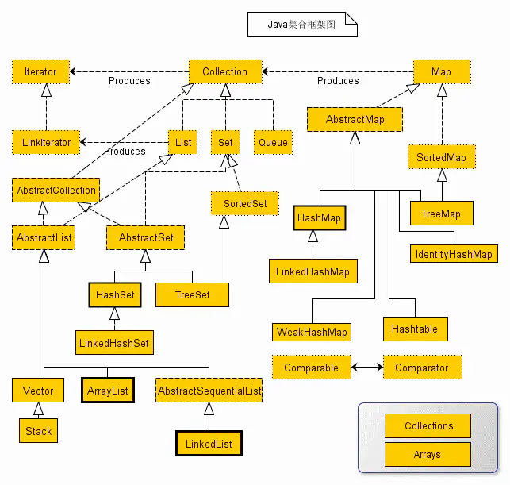

## PriorityQueue实现原理

+ 数组
+ 扩容
+ 堆排序如何实现？

[参考连接](https://blog.csdn.net/u013309870/article/details/71189189)


## 为什么要重写hashCode和equals方法

如果不重写，则会默认调用Object类的hashCode和equals方法，Object类的hashCode方法是根据对象内存首地址计算得到，equals方法也同样是根据对象内存首地址进行判断。这在很多场景下是不可用的。

## hashCode与equals区别

+ 规范1：若重写equals(Object obj)方法，有必要重写hashcode()方法，确保通过equals(Object obj)方法判断结果为true的两个对象具备相等的hashcode()返回值。说得简单点就是：“如果两个对象相同，那么他们的hashcode应该 相等”。不过请注意：这个只是规范，如果你非要写一个类让equals(Object obj)返回true而hashcode()返回两个不相等的值，编译和运行都是不会报错的。不过这样违反了Java规范，程序也就埋下了BUG。 
+ 规范2：如果equals(Object obj)返回false，即两个对象“不相同”，并不要求对这两个对象调用hashcode()方法得到两个不相同的数。说的简单点就是：“如果两个对象不相同，他们的hashcode可能相同”。 
根据这两个规范，可以得到如下推论： 
 - 1、如果两个对象equals，Java运行时环境会认为他们的hashcode一定相等。 
 - 2、如果两个对象不equals，他们的hashcode有可能相等。 
 - 3、如果两个对象hashcode相等，他们不一定equals。 
 - 4、如果两个对象hashcode不相等，他们一定不equals。 

## jdk1.8 Map接口实现类的比较

Java为数据结构中的映射定义了一个接口java.util.Map，此接口主要有四个常用的实现类，分别是HashMap、Hashtable、LinkedHashMap和TreeMap，类继承关系如下图所示：


+ (1) HashMap：它根据键的hashCode值存储数据，大多数情况下可以直接定位到它的值，因而具有很快的访问速度，但遍历顺序却是不确定的。 HashMap最多只允许一条记录的键为null，允许多条记录的值为null。HashMap非线程安全，即任一时刻可以有多个线程同时写HashMap，可能会导致数据的不一致。如果需要满足线程安全，可以用 Collections的synchronizedMap方法使HashMap具有线程安全的能力，或者使用ConcurrentHashMap。
+ (2) Hashtable：Hashtable是遗留类，很多映射的常用功能与HashMap类似，不同的是它承自Dictionary类，并且是线程安全的，任一时间只有一个线程能写Hashtable，并发性不如ConcurrentHashMap，因为ConcurrentHashMap引入了分段锁。Hashtable不建议在新代码中使用，不需要线程安全的场合可以用HashMap替换，需要线程安全的场合可以用ConcurrentHashMap替换。
+ (3) LinkedHashMap：LinkedHashMap是HashMap的一个子类，使用双向连边，保存了记录的插入顺序，在用Iterator遍历LinkedHashMap时，先得到的记录肯定是先插入的，也可以在构造时带参数，按照访问次序排序。
+ (4) TreeMap：TreeMap实现SortedMap接口，能够把它保存的记录根据键排序，默认是按键值的升序排序，也可以指定排序的比较器，当用Iterator遍历TreeMap时，得到的记录是排过序的。如果使用排序的映射，建议使用TreeMap。在使用TreeMap时，key必须实现Comparable接口或者在构造TreeMap传入自定义的Comparator，否则会在运行时抛出java.lang.ClassCastException类型的异常。

对于上述四种Map类型的类，要求映射中的key是不可变对象。不可变对象是该对象在创建后它的哈希值不会被改变。如果对象的哈希值发生变化，Map对象很可能就定位不到映射的位置了。

## HashMap实现原理

### 存储结构

从结构实现来讲，HashMap是数组+链表+红黑树（JDK1.8增加了红黑树部分）实现的，如下如所示。


> HashMap类中有一个非常重要的字段，就是 Node[] table，即哈希桶数组，明显它是一个Node的数组。

```java
static class Node<K,V> implements Map.Entry<K,V> {
        final int hash;    //用来定位数组索引位置
        final K key;
        V value;
        Node<K,V> next;   //链表的下一个node

        Node(int hash, K key, V value, Node<K,V> next) { ... }
        public final K getKey(){ ... }
        public final V getValue() { ... }
        public final String toString() { ... }
        public final int hashCode() { ... }
        public final V setValue(V newValue) { ... }
        public final boolean equals(Object o) { ... }
}
```
Node是HashMap的一个内部类，实现了Map.Entry接口，本质是就是一个映射(键值对)。上图中的每个黑色圆点就是一个Node对象。


https://crossoverjie.top/2018/07/23/java-senior/ConcurrentHashMap/


## 集合类:HashMap和HashTable、ConcurrentHashMap(源码比较) **重点**

### HashMap是非线程安全，HashTable和ConcurrentHashMap是线程安全

### HashMap与HashTable比较

不同点 |HashMap|HashTable
---- | ---- | ----
实现原理 | 继承自AbstractMap类 | 继承自Dictionary(JDK1.0添加)没用过
初始化容量不同(二者负载因子均为0.75)|初始容量为16|初始容量为11
扩容机制不同(当前容量大于总容量*负载因子)|总容量翻倍(保持始终为2的幂)|总容量翻倍+1
迭代器不同|使用Iterator迭代器，是fail-fast的|使用Enumerator，不是fail-fast的


### HashMap底层原理 关键点

+ JDK1.8引入数组加链表+红黑树
+ 链表长度超过8时转成红黑树

> Hashmap中的链表大小超过八个时会自动转化为红黑树，当删除小于六时重新变为链表，为啥呢？

根据泊松分布，在负载因子默认为0.75的时候，单个hash槽内元素个数为8的概率小于百万分之一，所以将7作为一个分水岭，等于7的时候不转换，大于等于8的时候才进行转换，小于等于6的时候就化为链表。

### ConcurrentHashMap

+ JDK1.7 有segment分段锁
+ JDK1.8 放弃分段锁[为何？](https://cloud.tencent.com/developer/article/1509556)
+ CAS和synchronied
+ get和put操作


[看这篇屁话](https://mp.weixin.qq.com/s/AixdbEiXf3KfE724kg2YIw)

JDK1.7和JDK1.8对于二者改动及原因


## ArrayList、LinkedList、TreeMap、LinkedHashMap、HashSet



需要了解底层数据结构和各容器之间的优劣比较

## 讲一下HashMap的原理，如果链表过长怎么办，如果想让Map按照put的顺序存放键值对应该使用什么类？

HashMap在存在hash冲突的情况下，会使用链表或红黑树存储hash冲突的key，一般当链表长度超过`TREEIFY_THRESHOLD`会将链表转成红黑树。

Map按照元素大小排序用TreeMap

Map按照元素put顺序用LinkedHashMap


## Session与Cookie区别

session是存储在服务器端,cookie是存储在客户端的,所以安全来讲session的安全性要比cookie高,然后我们获取session里的信息是通过存放在**会话cookie**里的sessionid获取的。又由于session是存放在服务器的内存中,所以session里的东西不断增加会造成服务器的负担,所以会把很重要的信息存储在session中,而把一些次要东西存储在客户端的cookie里。

cookie确切的说分为两大类分为**会话cookie和持久化cookie**,会话cookie确切的说是存放在客户端浏览器的内存中,所以说他的生命周期和浏览器是一致的,浏览器关了会话cookie也就消失了,然而持久化cookie是存放在客户端硬盘中,而持久化cookie的生命周期就是我们在设置cookie时候设置的那个保存时间,然后我们考虑一问题当浏览器关闭时session会不会丢失,从上面叙述分析session的信息是通过sessionid获取的,而sessionid是存放在会话cookie当中的,当浏览器关闭的时候会话cookie消失所以我们的sessionid也就消失了,但是session的信息还存在服务器端,这时我们只是查不到所谓的session但它并不是不存在。那么,session在什么情况下丢失,就是在服务器关闭的时候,或者是sessio过期,再或者调用了invalidate()的或者是我们想要session中的某一条数据消失调用session.removeAttribute()方法,然后session在什么时候被创建呢,确切的说是通过调用session.getsession来创建,这就是session与cookie的区别。

> Session的生命周期

+ Session何时生效

Session在用户第一次访问服务器时创建，注意只有访问JSP、Servlet等程序时才会创建Session，而访问HTML、image等静态文件时不会产生Session,可调用request.getSession(true)强制生成Session。

+ Session何时失效
 - 服务器会把长时间没有活动的Session从服务器内存中清除，此时Session便失效。Tomcat中Session的默认失效时间为20分钟。
 - 调用Session的invalidate方法。
        ```java
            HttpSession session = request.getSession();
            session.invalidate();//注销该request的所有session
        ```
 - session的过期时间是从什么时候开始计算的？是从一登录就开始计算还是说从停止活动开始计算？
    从session不活动的时候开始计算，如果session一直活动，session就总不会过期。从该Session未被访问,开始计时; 一旦Session被访问,计时清0;

## JDK1.8新特性

[参考文章](https://www.jianshu.com/p/5b800057f2d8)

### 语言特性

+ Lambda表达式和函数式接口
+ 接口的默认方法和静态方法
+ 方法引用
+ 重复注解`@Repeatable`
+ 更好的类型推断
+ 拓宽注解的应用场景

### 编译器特性

+ 参数名称
  
### 库

+ Optional
+ Streams
+ Date/Time API
+ Nashorn JavaScript引擎
+ Base64
+ 并行数组
+ 并发性

### 工具

+ Nashorn引擎：jjs
+ 类依赖分析器：jdeps

### 运行时(JVM)

使用Metaspace（JEP 122）代替持久代（PermGen space）。在JVM参数方面，使用-XX:MetaSpaceSize和-XX:MaxMetaspaceSize代替原来的-XX:PermSize和-XX:MaxPermSize。

## NIO原理

### NIO与传统IO比较

+ 面向缓冲和面向流
+ 非阻塞与阻塞
+ 选择器(单线程管理多个通道)
  
### NIO与IO适用场景不同

由于NIO是面向缓冲的这导致数据处理前都需要处理缓冲区中数据是否完整或者读取完毕。

NIO适用于连接数大，但每次只传送极少数的数据，如聊天服务器

IO适合于连接数少，但需要传输大量数据

## NIO原理

NIO核心 buffer channal selector

**小小tips：**

+ 同步与异步：同步是指用户空间是主动发起IO请求的一方，内核空间被动接受，而异步相反，用户空间线程向内核空间注册各种回调函数，由内核空间调用
+ 阻塞与非阻塞

**四种IO模型**

[参考文章](https://www.cnblogs.com/crazymakercircle/p/10225159.html#%E5%9B%9B%E7%A7%8D%E4%B8%BB%E8%A6%81%E7%9A%84io%E6%A8%A1%E5%9E%8B)

+ 同步阻塞(IO)
+ 同步非阻塞(NIO)
+ 多路复用  IO多路复用模型，就是通过一种新的系统调用，一个进程可以监视多个文件描述符，一旦某个描述符就绪（一般是内核缓冲区可读/可写），内核kernel能够通知程序进行相应的IO系统调用。
+ 异步IO模型

## Java序列化

## 数组内存分配

[参考文档](https://blog.csdn.net/pange1991/article/details/80898344)

**对于64位操作系统，引用类型指针压缩前8字节，压缩后斩4字节**

+ 指针压缩前：数组对象的对象头占用24个字节（8字节MarkWord+8字节类型指针+8字节数组长度）
+ 指针压缩后：启用压缩之后占用16个字节（8字节MarkWord+4字节类型指针+4字节数组长度）

拿new Integer[3]来具体解释下：

+ 未开启压缩：24（对象头）+ 8*3 = 48，不需要padding；
+ 开启压缩：16（对象头）+ 4*3 = 28，需要对齐填充 28 + 4(padding) = 32，其他依次类推。


