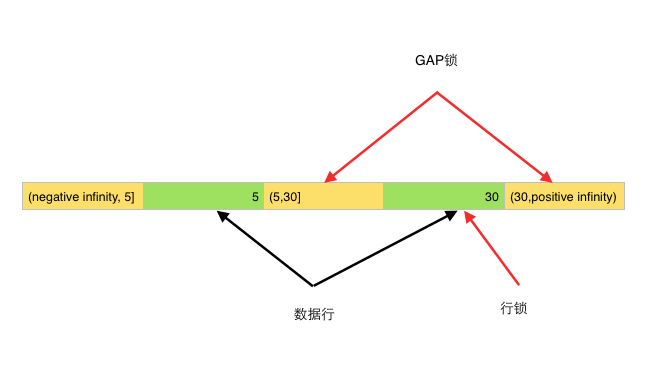

## 相关概念理解

### 联合主键和复合主键

联合主键体现在多个表上，复合主键体现在一个表中的多个字段

联合主键：

```sql
-- 学生表：student

create table student(
id mediumint  auto_increment comment '主键id',
name varchar(30) comment '姓名',
age smallint comment '年龄',
primary key(id)
)
engine = myisam,
charset = utf8,
comment = '学生'

-- 课程表：course

create table course(
id mediumint  auto_increment comment '主键id',
name varchar(30) comment '课程名称',
primary key(id)
)
engine = myisam,
charset = utf8,
comment = '课程'

-- 学生课程表：stu_cour

create table IF NOT EXISTS stu_cour(
id mediumint  auto_increment comment '主键id',
stu_id mediumint comment '学生表id',
cour_id mediumint comment '课程表id',
primary key(id)
)
engine = myisam,
charset = utf8,
comment = '学生课程表'

-- 此时stu_cour中id就表示联合主键，通过id可以获取学生和课程的一条记录
```
复合主键：

```sql
create table student(
name varchar(30) comment '姓名',
age smallint comment '年龄',
sex enum('男','女') comment '性别',
primary key(name,age)
)
engine = myisam,
charset = utf8,
comment = '学生'
```

## 数据库三大范式

一般地，在进行数据库设计时，应遵循三大原则，也就是我们通常说的三大范式：
+ 第一范式要求确保表中每列的原子性，也就是不可拆分；
+ 第二范式要求确保表中每列与主键相关，而不能只与主键的某部分相关（主要针对联合主键[什么是联合主键]），主键列与非主键列遵循完全函数依赖关系，也就是完全依赖；
+ 第三范式确保主键列之间没有传递函数依赖关系，也就是消除传递依赖。
  
  实体中的属性不能是其他实体中的非主属性。因为这样会出现冗余。即：属性不依赖于其他非主属性。

  如果一个实体中出现其他实体的非主属性，可以将这两个实体用外键关联，而不是将另一张表的非主属性直接写在当前表中。

  第三范式需要确保数据表中的每一列数据都和主键直接相关，而不能间接相关。

  比如在设计一个订单数据表的时候，可以将客户编号作为一个外键和订单表建立相应的关系。而不可以在订单表中添加关于客户其它信息（比如姓名、所属公司等）的字段。


## Mysql索引

### Mysql索引目的

索引的目的在于**提高查询效率**，可以类比字典，如果要查“mysql”这个单词，我们肯定需要定位到m字母，然后从下往下找到y字母，再找到剩下的sql。如果没有索引，那么你可能需要把所有单词看一遍才能找到你想要的，如果我想找到m开头的单词呢？或者ze开头的单词呢？是不是觉得如果没有索引，这个事情根本无法完成？

### 索引有哪几种

+ hash：可以快速精确查询，但不能范围查询
+ 平衡二叉树：完全平衡二叉树是有序的，所以也是支持范围查找的。
+ B树：一个节点可以存储多个元素，相对于完全平衡二叉树所以整棵树的高度就降低了，磁盘IO效率提高了。
+ B+树：

### “为什么底层数据结构使用B+树，而不是B树？”

+ B-树（B类树）的特定就是每层节点数目非常多，层数很少，目的就是为了就少磁盘IO次数，当查询数据的时候，最好的情况就是很快找到目标索引，然后读取数据，使用B+树就能很好的完成这个目的，但是B-树的每个节点都有data域（指针），这无疑增大了节点大小，说白了增加了磁盘IO次数（**磁盘IO一次读出的数据量大小是固定的，单个数据变大，每次读出的就少，IO次数增多，一次IO多耗时啊！**），而B+树除了叶子节点其它节点并不存储数据，节点小，磁盘IO次数就少。这是优点之一。
+ B+树所有的Data域在叶子节点，一般来说都会进行一个优化，就是将所有的叶子节点用指针串起来。这样遍历叶子节点就能获得全部数据，这样就能进行区间访问啦。

**数据库索引采用B+树的主要原因是 B树在提高了磁盘IO性能的同时并没有解决元素遍历的效率低下的问题。正是为了解决这个问题，B+树应运而生。B+树只要遍历叶子节点就可以实现整棵树的遍历。而且在数据库中基于范围的查询是非常频繁的，而B树不支持这样的操作（或者说效率太低）**


### 聚簇索引与非聚簇索引

[**参考文章**](https://www.jianshu.com/p/54c6d5db4fe6)

聚簇索引也称为主键索引，其索引树的叶子节点中存的是整行数据，表中行的物理顺序与键值的逻辑（索引）顺序相同。一个表只能包含一个聚集索引。因为索引（目录）只能按照一种方法进行排序。

非聚簇索引（普通索引）的叶子节点内容是主键的值。在InnoDB里，非主键索引也被称为二级索引（secondary index）。

> MySQL回表：
+ 如果语句是 `select * from User where id=3`，即主键查询方式，则只需要搜索 主键索引树。
+ 如果语句是 `select * from User where uid=23`，即普通索引查询方式，则需要先搜索 普通索引树，得到其对应的主键值为 3，再到主键索引树搜索一次。这个过程称为回表。

聚集索引与非聚集索引的区别是：叶节点是否存放一整行记录

InnoDB 主键使用的是聚簇索引，MyISAM 不管是主键索引，还是二级索引使用的都是非聚簇索引。

+ 1.对于**非聚簇索引**表来说，表数据和索引是分成两部分存储的，主键索引和二级索引存储上没有任何区别。使用的是B+树作为索引的存储结构，所有的节点都是索引，叶子节点存储的是索引+索引对应的记录的数据。
+ 2.对于**聚簇索引**表来说，表数据是和主键一起存储的，**主键索引的叶结点存储行数据(包含了主键值)，二级索引的叶结点存储行的主键值**。使用的是B+树作为索引的存储结构，非叶子节点都是索引关键字，但非叶子节点中的关键字中不存储对应记录的具体内容或内容地址。叶子节点上的数据是主键与具体记录(数据内容)。

**聚簇索引的优点**
+ 1.当你需要取出一定范围内的数据时，用聚簇索引也比用非聚簇索引好。
+ 2.当通过聚簇索引查找目标数据时理论上比非聚簇索引要快，因为非聚簇索引定位到对应主键时还要多一次目标记录寻址,即多一次I/O。
+ 3.使用覆盖索引扫描的查询可以直接使用页节点中的主键值。

**聚簇索引的缺点**

+ 1.插入速度严重依赖于插入顺序，按照主键的顺序插入是最快的方式，否则将会出现页分裂，严重影响性能。因此，对于InnoDB表，我们一般都会定义一个自增的ID列为主键。
+ 2.更新主键的代价很高，因为将会导致被更新的行移动。因此，对于InnoDB表，我们一般定义主键为不可更新。
+ 3.二级索引访问需要两次索引查找，第一次找到主键值，第二次根据主键值找到行数据。二级索引的叶节点存储的是主键值，而不是行指针（非聚簇索引存储的是指针或者说是地址），这是为了减少当出现行移动或数据页分裂时二级索引的维护工作，但会让二级索引占用更多的空间。
+ 4.采用聚簇索引插入新值比采用非聚簇索引插入新值的速度要慢很多，因为插入要保证主键不能重复，判断主键不能重复，采用的方式在不同的索引下面会有很大的性能差距，聚簇索引遍历所有的叶子节点，非聚簇索引也判断所有的叶子节点，但是聚簇索引的叶子节点除了带有主键还有记录值，记录的大小往往比主键要大的多。这样就会导致聚簇索引在判定新记录携带的主键是否重复时进行昂贵的I/O代价。

### 索引的底层实现 B+树和红黑树、B树比较

### 索引失效

#### 1.索引不存储null值

更准确的说，单列索引不存储null值，复合索引不存储全为null的值。索引不能存储Null，所以对这列采用is null条件时，因为索引上根本

没Null值，不能利用到索引，只能全表扫描。

为什么索引列不能存Null值？

将索引列值进行建树，其中必然涉及到诸多的比较操作。Null值的特殊性就在于参与的运算大多取值为null。

这样的话，null值实际上是不能参与进建索引的过程。也就是说，null值不会像其他取值一样出现在索引树的叶子节点上。

#### 2.不适合键值较少的列（重复数据较多的列）

假如索引列TYPE有5个键值，如果有1万条数据，那么 WHERE TYPE = 1将访问表中的2000个数据块。

再加上访问索引块，一共要访问大于2000个的数据块。

如果全表扫描，假设10条数据一个数据块，那么只需访问1000个数据块，既然全表扫描访问的数据块

少一些，肯定就不会利用索引了。

#### 3.前导模糊查询不能利用索引(like '%XX'或者like '%XX%')

假如有这样一列code的值为'AAA','AAB','BAA','BAB' ,如果where code like '%AB'条件，由于前面是模糊的，所以不能利用索引的顺序，必须一个个去找，看是否满足条件。这样会导致全索引扫描或者全表扫描。如果是这样的条件where code like 'A % '，就可以查找CODE中A开头的CODE的位置，当碰到B开头的数据时，就可以停止查找了，因为后面的数据一定不满足要求。这样就可以利用索引了。

#### 4.索引失效的几种情况
+ 1.如果条件中有or，即使其中有条件带索引也不会使用(这也是为什么尽量少用or的原因)
 要想使用or，又想让索引生效，只能将or条件中的每个列都加上索引
+ 2.对于多列索引，不是使用的第一部分，则不会使用索引
+ 3.like查询以%开头
+ 4.如果列类型是字符串，那一定要在条件中将数据使用引号引用起来,否则不使用索引
+ 5.如果mysql估计使用全表扫描要比使用索引快,则不使用索引

#### 5.MySQL主要提供2种方式的索引：B-Tree索引，Hash索引
B树索引具有范围查找和前缀查找的能力，对于有N节点的B树，检索一条记录的复杂度为O(LogN)。相当于二分查找。

哈希索引只能做等于查找，但是无论多大的Hash表，查找复杂度都是O(1)。

显然，如果值的差异性大，并且以等值查找（=、 <、>、in）为主，Hash索引是更高效的选择，它有O(1)的查找复杂度。

如果值的差异性相对较差，并且以范围查找为主，B树是更好的选择，它支持范围查找。

此外，查看索引的使用情况
```sql
show status like ‘Handler_read%';
```
大家可以注意：
+ handler_read_key:这个值越高越好，越高表示使用索引查询到的次数
+ handler_read_rnd_next:这个值越高，说明查询低效

### 建索引的几大原则

+ 1.最左前缀匹配原则，非常重要的原则，mysql会一直向右匹配直到遇到范围查询(>、<、between、like)就停止匹配，比如a = 1 and b = 2 and c > 3 and d = 4 如果建立(a,b,c,d)顺序的索引，d是用不到索引的，如果建立(a,b,d,c)的索引则都可以用到，a,b,d的顺序可以任意调整。
+ 2.=和in可以乱序，比如a = 1 and b = 2 and c = 3 建立(a,b,c)索引可以任意顺序，mysql的查询优化器会帮你优化成索引可以识别的形式。
+ 3.尽量选择区分度高的列作为索引，区分度的公式是count(distinct col)/count(*)，表示字段不重复的比例，比例越大我们扫描的记录数越少，唯一键的区分度是1，而一些状态、性别字段可能在大数据面前区分度就是0，那可能有人会问，这个比例有什么经验值吗？使用场景不同，这个值也很难确定，一般需要join的字段我们都要求是0.1以上，即平均1条扫描10条记录。
+ 4.索引列不能参与计算，保持列“干净”，比如from_unixtime(create_time) = ’2014-05-29’就不能使用到索引，原因很简单，b+树中存的都是数据表中的字段值，但进行检索时，需要把所有元素都应用函数才能比较，显然成本太大。所以语句应该写成create_time = unix_timestamp(’2014-05-29’)。
+ 5.尽量的扩展索引，不要新建索引。比如表中已经有a的索引，现在要加(a,b)的索引，那么只需要修改原来的索引即可。

### 索引优化策略

### `explain`慢查询优化

步骤：

+ 0.先运行看看是否真的很慢，注意设置SQL_NO_CACHE
+ 1.where条件单表查，锁定最小返回记录表。这句话的意思是把查询语句的where都应用到表中返回的记录数最小的表开始查起，单表每个字段分别查询，看哪个字段的区分度最高
+ 2.explain查看执行计划，是否与1预期一致（从锁定记录较少的表开始查询）
+ 3.order by limit 形式的sql语句让排序的表优先查
+ 4.了解业务方使用场景
+ 5.加索引时参照建索引的几大原则
+ 6.观察结果，不符合预期继续从0分析

## Mysql事务

### 事务特性(ACID)及其实现

[参考](https://www.cnblogs.com/kismetv/p/10331633.html)

+ 原子性（atomicity，或稱不可分割性）
+ 一致性（consistency）
+ 隔离性（isolation，又称独立性）
+ 持久性（durability）

按照严格的标准，只有同时**满足ACID特性才是事务**；但是在各大数据库厂商的实现中，真正满足ACID的事务少之又少。例如MySQL的NDB Cluster事务不满足持久性和隔离性；**InnoDB默认事务隔离级别是可重复读，不满足隔离性；**Oracle默认的事务隔离级别为READ COMMITTED，不满足隔离性……因此与其说ACID是事务必须满足的条件，不如说它们是衡量事务的四个维度。

### 原子性

#### **定义**

原子性是指一个事务是一个不可分割的工作单位，其中的操作要么都做，要么都不做；如果事务中一个sql语句执行失败，则已执行的语句也必须回滚，数据库退回到事务前的状态。

#### 实现原理：undo log

在说明原子性原理之前，首先介绍一下MySQL的事务日志。**MySQL的日志有很多种，如二进制日志、错误日志、查询日志、慢查询日志等，此外InnoDB存储引擎还提供了两种事务日志：redo log(重做日志)和undo log(回滚日志)。其中redo log用于保证事务持久性；undo log则是事务原子性和隔离性实现的基础。**

下面说回undo log。实现原子性的关键，是当事务回滚时能够撤销所有已经成功执行的sql语句。**InnoDB实现回滚，靠的是undo log：**当事务对数据库进行修改时，InnoDB会生成对应的undo log；如果事务执行失败或调用了rollback，导致事务需要回滚，便可以利用undo log中的信息将数据回滚到修改之前的样子。

**undo log属于逻辑日志，它记录的是sql执行相关的信息。当发生回滚时，InnoDB会根据undo log的内容做与之前相反的工作：对于每个insert，回滚时会执行delete；对于每个delete，回滚时会执行insert；对于每个update，回滚时会执行一个相反的update，把数据改回去。**

以update操作为例：当事务执行update时，其生成的undo log中会包含被修改行的主键(以便知道修改了哪些行)、修改了哪些列、这些列在修改前后的值等信息，回滚时便可以使用这些信息将数据还原到update之前的状态。

### 持久性

#### 定义

持久性是指事务一旦提交，它对数据库的改变就应该是永久性的。接下来的其他操作或故障不应该对其有任何影响。

#### 实现原理：redo log

redo log和undo log都属于InnoDB的事务日志。下面先聊一下redo log存在的背景。

**InnoDB作为MySQL的存储引擎，数据是存放在磁盘中的，但如果每次读写数据都需要磁盘IO，效率会很低。**为此，InnoDB提供了缓存(Buffer Pool)，Buffer Pool中包含了磁盘中部分数据页的映射，作为访问数据库的缓冲：当从数据库读取数据时，会首先从Buffer Pool中读取，如果Buffer Pool中没有，则从磁盘读取后放入Buffer Pool；当向数据库写入数据时，会首先写入Buffer Pool，Buffer Pool中修改的数据会定期刷新到磁盘中（这一过程称为**刷脏**）。

**Buffer Pool的使用大大提高了读写数据的效率，但是也带了新的问题：如果MySQL宕机，而此时Buffer Pool中修改的数据还没有刷新到磁盘，就会导致数据的丢失，事务的持久性无法保证。**

于是，**redo log被引入来解决这个问题：当数据修改时，除了修改Buffer Pool中的数据，还会在redo log记录这次操作；**当事务提交时，会调用fsync接口对redo log进行刷盘。如果MySQL宕机，重启时可以读取redo log中的数据，对数据库进行恢复。redo log采用的是WAL（Write-ahead logging，预写式日志），**所有修改先写入日志，再更新到Buffer Pool**，保证了数据不会因MySQL宕机而丢失，从而满足了持久性要求。

**既然redo log也需要在事务提交时将日志写入磁盘，为什么它比直接将Buffer Pool中修改的数据写入磁盘(即刷脏)要快呢？主要有以下两方面的原因：**
+ （1）刷脏是随机IO，因为每次修改的数据位置随机，但写redo log是追加操作，属于顺序IO。
+ （2）刷脏是以数据页（Page）为单位的，MySQL默认页大小是16KB，一个Page上一个小修改都要整页写入；而redo log中只包含真正需要写入的部分，无效IO大大减少。

#### redo log与binlog

我们知道，在MySQL中还存在binlog(二进制日志)也可以记录写操作并用于数据的恢复，但二者是有着根本的不同的：
+ （1）作用不同：redo log是用于crash recovery的，保证MySQL宕机也不会影响持久性；binlog是用于point-in-time recovery的，保证服务器可以基于时间点恢复数据，此外binlog还用于主从复制。
+ （2）层次不同：**redo log是InnoDB存储引擎实现的**，而**binlog是MySQL的服务器层实现的**，同时支持InnoDB和其他存储引擎。
+ （3）内容不同：redo log是物理日志，内容基于磁盘的Page；binlog的内容是二进制的，根据binlog_format参数的不同，可能基于sql语句、基于数据本身或者二者的混合。
+ （4）写入时机不同：binlog在事务提交时写入；redo log的写入时机相对多元：
 前面曾提到：当事务提交时会调用fsync对redo log进行刷盘；这是默认情况下的策略，修改innodb_flush_log_at_trx_commit参数可以改变该策略，但事务的持久性将无法保证。

 除了事务提交时，还有其他刷盘时机：如master thread每秒刷盘一次redo log等，这样的好处是不一定要等到commit时刷盘，commit速度大大加快。

### 隔离性

**乐观锁在数据库中就是MVCC，悲观锁就是行锁和表锁。**

#### 定义

**与原子性、持久性侧重于研究事务本身不同，隔离性研究的是不同事务之间的相互影响**。**隔离性是指，事务内部的操作与其他事务是隔离的，并发执行的各个事务之间不能互相干扰**。严格的隔离性，对应了事务隔离级别中的Serializable (可串行化)，但实际应用中出于性能方面的考虑很少会使用可串行化。

隔离性追求的是并发情形下事务之间互不干扰。简单起见，我们仅考虑最简单的读操作和写操作(暂时不考虑带锁读等特殊操作)，那么隔离性的探讨，主要可以分为两个方面：
+ (一个事务)写操作对(另一个事务)写操作的影响：锁机制保证隔离性
+ (一个事务)写操作对(另一个事务)读操作的影响：MVCC保证隔离性

#### 事务的隔离级别(读未提交、读已提交、重复读、序列化)

[参考文章](https://blog.csdn.net/JIESA/article/details/51317164)

+ 读未提交：可以读到另外事务未提交的写，会造成脏读
+ 读已提交：可以读到另外事务已提交的写，但可能造成不可重复读
+ 重复读：在事务写的时候，别的事务不可写。可能造成幻读。Mysql默认隔离级别，通过Next-Key锁(行锁与GAP锁结合)解决幻读
+ 序列化：事务顺序执行，不仅可以避免脏读、不可重复读，还避免了幻像读，通过加X锁，开销太大。([X锁-排他锁，S锁-共享锁](https://blog.csdn.net/yuwei19840916/article/details/3245107))

#### 通过锁的方式实现隔离性

+ 读写锁：
 读写锁的概念很平常，当你在读取数据的时候，应该先加读锁，读取完之后的某个时间再解开读锁，那么加了读锁的数据，应该需要有什么特性呢，应该只能读，不能写，因为加了读锁，说明有事务准备读取这个数据，如果被别的事务重写这个事务，那数据就不准确了。所以一个事务给这个数据加了读锁，别的事务也可以对这个数据加读锁，因为大家都是只读不写。

 **写锁则具有排他性**（exclusive lock），当一个事务准备对一个数据进行写操作的时候，先要对数据加写锁，那么数据就是可变的，这时候，其他事务就无法对这个数据加读锁了，除非这个写锁释放。
+ 两端式提交锁（Two-phase locking）
两段式提交分为两步：

 + 加锁阶段：在该阶段可以进行加锁操作。在对任何数据进行读操作之前要申请并获得S锁（共享锁，其它事务可以继续加共享锁，但不能加排它锁），在进行写操作之前要申请并获得X锁（排它锁，其它事务不能再获得任何锁）。加锁不成功，则事务进入等待状态，直到加锁成功才继续执行。
 + 解锁阶段：当事务释放了一个封锁以后，事务进入解锁阶段，在该阶段只能进行解锁操作不能再进行加锁操作。

|事务|加锁/解锁处理|
|----|----|
|begin;||
|insert into test...|加insert对应的锁|
|update test set...|加update对应的锁|
|delete from test...|加delete对应的锁|
|commit;|事务提交时，同时释放insert、update、delete对应的锁|

#### MVCC在MySQL的InnoDB中的实现

[参考文章](https://www.jianshu.com/p/f692d4f8a53e)

+ 数据行版本号
+ 删除版本号

在InnoDB中，会在每行数据后添加两个额外的隐藏的值来实现MVCC，这两个值**一个记录这行数据何时被创建，另外一个记录这行数据何时过期（或者被删除）**。 在实际操作中，存储的并不是时间，而是事务的版本号，每开启一个新事务，事务的版本号就会递增。 在可重读Repeatable reads事务隔离级别下：

+ SELECT时，读取创建版本号<=当前事务版本号，删除版本号为空或>当前事务版本号。
+ INSERT时，保存当前事务版本号为行的创建版本号
+ DELETE时，保存当前事务版本号为行的删除版本号
+ UPDATE时，插入一条新纪录，保存当前事务版本号为行创建版本号，同时保存当前事务版本号到原来删除的行

通过MVCC，虽然每行记录都需要额外的存储空间，更多的行检查工作以及一些额外的维护工作，但可以减少锁的使用，大多数读操作都不用加锁，读数据操作很简单，性能很好，并且也能保证只会读取到符合标准的行，也只锁住必要行。

#### Innodb的RR级别如何解决幻读问题

[参考](https://tech.meituan.com/2014/08/20/innodb-lock.html)

在RC级别中，事务A修改了所有teacher_id=30的数据，但是当事务B insert进新数据后，事务A发现莫名其妙多了一行teacher_id=30的数据，而且没有被之前的update语句所修改，这就是“当前读”的幻读。

RR级别中，事务A在update后加锁，事务B无法插入新数据，这样事务A在update前后读的数据保持一致，避免了幻读。这个锁，就是**Gap锁。**

MySQL是这么实现的：

在class_teacher这张表中，teacher_id是个索引，那么它就会维护一套B+树的数据关系，为了简化，我们用链表结构来表达（实际上是个树形结构，但原理相同）



如果使用的是没有索引的字段，比如`update class_teacher set teacher_id=7 where class_name=‘初三八班（即使没有匹配到任何数据）’`,那么会给全表加入gap锁。同时，它不能像上文中行锁一样经过MySQL Server过滤自动解除不满足条件的锁，因为没有索引，则这些字段也就没有排序，也就没有区间。除非该事务提交，否则其它事务无法插入任何数据。

**行锁防止别的事务修改或删除，GAP锁防止别的事务新增，行锁和GAP锁结合形成的的Next-Key锁共同解决了RR级别在写数据时的幻读问题。**

### 一致性

#### 基本概念

一致性是指事务执行结束后，数据库的完整性约束没有被破坏，事务执行的前后都是合法的数据状态。数据库的完整性约束包括但不限于：实体完整性（如行的主键存在且唯一）、列完整性（如字段的类型、大小、长度要符合要求）、外键约束、用户自定义完整性（如转账前后，两个账户余额的和应该不变）。

#### 实现

可以说，一致性是事务追求的最终目标：前面提到的原子性、持久性和隔离性，都是为了保证数据库状态的一致性。此外，除了数据库层面的保障，一致性的实现也需要应用层面进行保障。

实现一致性的措施包括：

保证原子性、持久性和隔离性，如果这些特性无法保证，事务的一致性也无法保证
数据库本身提供保障，例如不允许向整形列插入字符串值、字符串长度不能超过列的限制等
应用层面进行保障，例如如果转账操作只扣除转账者的余额，而没有增加接收者的余额，无论数据库实现的多么完美，也无法保证状态的一致

https://www.cnblogs.com/kismetv/p/10331633.html


### 事务的隔离级别分别解决哪些问题(脏读、不可重复读、幻读丢失修改)

|隔离级别|脏读|不可重复读|幻读|
|----|----|----|----|
|RU读为提交|可能|可能|可能|
|RC读已提交|不可能|可能|可能|
|RR可重复读|不可能|不可能|可能|
|序列化|不可能|不可能|不可能|

Innodb在RR级别解决幻读采用Next-Key锁(GAP锁和行锁)方法

### 事务的回滚(undo、redo日志)

[MYSQL 之DDL、DML、DCL、TCL的区别](https://blog.csdn.net/u012732259/article/details/39524405)

+ DDL:操作表结构的命令 如: CREATE、ALTER、DROP
+ DML：操作数据的命令 如select update delete insert

事务的回滚适用于DML，不适用于DDL

那么DDL事务回滚

先DCL 再 DDL 最后将DML放入事务中

## 存储引擎

### MyISAM与InnoDB的区别

两种类型最主要的差别就是**Innodb支持事务处理与外键和行级锁**。而MyISAM不支持.所以MyISAM往往就容易被人认为只适合在小项目中使用。**MyISAM类型的表强调的是性能，其执行数度比InnoDB类型更快**。

以下是一些细节和具体实现的差别：
+ 1.InnoDB不支持FULLTEXT类型的索引。
+ 2.InnoDB中不保存表的具体行数，也就是说，执行`select count(*) from table`时，InnoDB要扫描一遍整个表来计算有多少行，但是MyISAM只要简单的读出保存好的行数即可。注意的是，当count(*)语句包含 where条件时，两种表的操作是一样的。
+ 3.对于AUTO_INCREMENT类型的字段，InnoDB中必须包含只有该字段的索引，但是在MyISAM表中，可以和其他字段一起建立联合索引。
+ 4.`DELETE FROM table`时，InnoDB不会重新建立表，而是一行一行的删除。
+ 5.`LOAD TABLE FROM MASTER`操作对InnoDB是不起作用的，解决方法是首先把InnoDB表改成MyISAM表，导入数据后再改成InnoDB表，但是对于使用的额外的InnoDB特性(例如外键)的表不适用。
+ 另外，InnoDB表的行锁也不是绝对的，假如在执行一个SQL语句时MySQL不能确定要扫描的范围，InnoDB表同样会锁全表，例如`update table set num=1 where name like “%aaa%”`

作为使用MySQL的用户角度出发，Innodb和MyISAM都是比较喜欢的，**如果数据库平台要达到需求：99.9%的稳定性，方便的扩展性和高可用性来说的话，MyISAM绝对是首选。**

原因如下：
+ 1、平台上承载的大部分项目是读多写少的项目，而MyISAM的读性能是比Innodb强不少的。
+ 2、MyISAM的索引和数据是分开的，并且索引是有压缩的，内存使用率就对应提高了不少。能加载更多索引，而Innodb是索引和数据是紧密捆绑的，没有使用压缩从而会造成Innodb比MyISAM体积庞大不小。
+ 3、经常隔1，2个月就会发生应用开发人员不小心update一个表where写的范围不对，导致这个表没法正常用了，这个时候MyISAM的优越性就体现出来了，随便从当天拷贝的压缩包取出对应表的文件，随便放到一个数据库目录下，然后dump成sql再导回到主库，并把对应的binlog补上。如果是Innodb，恐怕不可能有这么快速度，别和我说让Innodb定期用导出xxx.sql机制备份，因为最小的一个数据库实例的数据量基本都是几十G大小。
+ 4、从接触的应用逻辑来说，select count(*) 和order by 是最频繁的，大概能占了整个sql总语句的60%以上的操作，而这种操作Innodb其实也是会锁表的，很多人以为Innodb是行级锁，那个只是where对它主键是有效，非主键的都会锁全表的。
+ 5、还有就是经常有很多应用部门需要我给他们定期某些表的数据，MyISAM的话很方便，只要发给他们对应那表的frm.MYD,MYI的文件，让他们自己在对应版本的数据库启动就行，而Innodb就需要导出xxx.sql了，因为光给别人文件，受字典数据文件的影响，对方是无法使用的。
+ 6、如果和MyISAM比insert写操作的话，Innodb还达不到MyISAM的写性能，如果是针对基于索引的update操作，虽然MyISAM可能会逊色Innodb,但是那么高并发的写，从库能否追的上也是一个问题，还不如通过多实例分库分表架构来解决。
+ 7、如果是用MyISAM的话，merge引擎可以大大加快应用部门的开发速度，他们只要对这个merge表做一些select count(*)操作，非常适合大项目总量约几亿的rows某一类型(如日志，调查统计)的业务表。
+ 当然Innodb也不是绝对不用，用事务的项目就用Innodb的。另外，可能有人会说你MyISAM无法抗太多写操作，但是可以通过架构来弥补。

### 上述存储引擎在索引结构方面的区别

### 各自的使用场景

## 锁(共享锁、排他锁、行锁、表锁、间隙锁)

[总结的很好](https://zhuanlan.zhihu.com/p/29150809)

### 如何避免死锁

## SQL语句(常见为聚类函数的使用、表连接查询)

## 分库分表策略

## SQL注入原理(常用SQL防注入框架)

## Mysql的sql处理过程

### Mysql逻辑分层

+ **第一层：Connect层**

**负责连接管理、授权认证、安全等等**

每个客户端的连接都对应着服务器上的一个线程。服务器上维护了一个线程池，避免为每个连接都创建销毁一个线程。当客户端连接到MySQL服务器时，服务器对其进行认证。可以通过用户名和密码的方式进行认证，也可以通过SSL证书进行认证。登录认证通过后，服务器还会验证该客户端是否有执行某个查询的权限。

+ **第二层：Service层**

**负责解析查询(编译SQL)，并对其进行优化(如调整表的读取顺序，选择合适的索引等)**。对于SELECT语句，在解析查询前，服务器会先检查查询缓存，如果能在其中找到对应的查询结果，则无需再进行查询解析、优化等过程，直接返回查询结果。存储过程、触发器、视图等都在这一层实现。

+ **第三层：存储引擎**

**存储引擎负责在MySQL中存储数据、提取数据、开启一个事务等等**。存储引擎通过API与上层进行通信，这些API屏蔽了不同存储引擎之间的差异，使得这些差异对上层查询过程透明。存储引擎不会去解析SQL。

### Mysql组件：

+ 1. 线程池组件（Connection Pool）：处理connetor发起的请求，处理用户登录、线程复用、连接数控制、内存检测和缓冲等功能

+ 2. 管理服务和工具组件（Mangerment Services & Utilities）主要是完成数据备份和恢复、复制、集群管理、配置、迁移和元数据

+ 3. SQL接口组件（Sql Interface）：进行DML、DLL、视图、存储过程、触发器等操作和管理，通过sql命令来获取查询结果

+ 4. 查询分析器组件（Parser）：这里接受并通过解析器来解析sql接口组件传递过来的sql语句，解析器通过词法分析和语法分析等步骤来验证sql的正确性，解析器是由Lex和YACC实现的，是一个很长的脚本
主要功能：
 - a . 将SQL语句分解成数据结构，并将这个结构传递到后续步骤，以后SQL语句的传递和处理就是基于这个结构的 
 - b.  如果在分解构成中遇到错误，那么就说明这个sql语句是不合理的

+ 5. 优化器组件（Optimizer）：用于优化查询sql

+ 6. 缓冲组件（Cache&Buffer）：将各个组件得出的结果缓冲起来，可以是查询结果，查询sql等等

+ 7. 插件式存储引擎（Storage Engines）：各种存储引擎插件，如myisam、innodb

+ 8. 物理文件（Files & Logs）：用于存储真正的数据，日志、索引和缓存等数据

## sql查询慢的原因

+ 1、没有索引或者没有用到索引（这是查询慢最常见的问题，是程序设计的缺陷）
+ 2、I/O 吞吐量小，形成了瓶颈效应。
+ 3、没有创建计算列导致查询不优化。
+ 4、内存不足
+ 5、网络速度慢
+ 6、查询出的数据量过大（可采用多次查询，其他的方法降低数据量）
+ 7、锁或者死锁（这是查询慢最常见的问题，是程序设计的缺陷）
+ 8、sp_lock,sp_who,活动的用户查看,原因是读写竞争资源。
+ 9、返回了不必要的行和列
+ 10、查询语句不好，没有优化


## 待回答问题

MySQL存储与索引有关问题
Float、Decimal 存储金额的区别？
Datetime、Timestamp 存储时间的区别？
Char、Varchar、Varbinary 存储字符的区别？
什么是索引？
对比一下B+树索引和 Hash索引？
MySQL索引类型有？
如何管理 MySQL索引？
对Explain参数及重要参数的理解？
索引利弊是什么及索引分类？
二叉树的转置是什么？
聚簇索引和非聚簇索引的区别？
B+tree 如何进行优化？索引遵循哪些原则？存储引擎会进行哪些自动优化？到底何时索引会失效？
索引与锁有什么关系？
还有什么其他的索引类型，各自索引有哪些优缺点？
MySQL事务和锁有关问题
谈谈对Innodb事务的理解？
说说数据库事务特点及潜在问题？
什么是MySQL隔离级别？
有多少种事务失效的场景，如何解决？
一致性非锁定读和一致性锁定读是什么？
Innodb如何解决幻读？
讲讲Innodb行锁？
死锁及监控是什么？
自增长与锁 ，锁的算法，锁问题，锁升级是什么？
乐观锁的线程如何做失败补偿？
高并发场景（领红包）如何防止死锁，保证数据一致性？
谈谈MySQL的锁并发？
MySQL性能优化有关问题
回表和集群因子是什么？
讲讲表与表之间的关系？
了解查询优化器模块；
查询优化的基本思路是什么？
说说MySQL读写分离、分库分表？
Query语句对数据库性能有什么影响？
Schema设计对系统性能有什么影响？
硬件环境对数据库的性能有什么影响？
表结构对性能有什么影响?
浅谈索引优化？
JOIN的原理是什么？
说说Sql优化的几点原则？
MySQL表设计及规范？
说说MySQL几种存储引擎应用场景？
MySQL常用优化方式有哪些？
MySQL常用监控？
MySQL瓶颈分析？
MySQL的系统学习方法