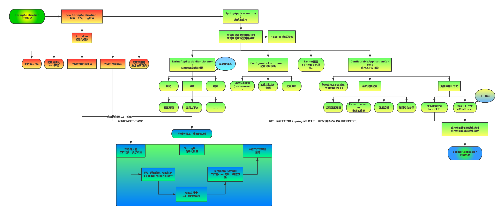
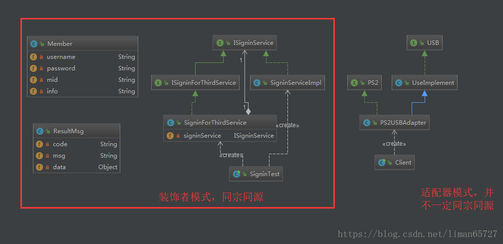

## Spring Aop实现方式，还有其他的什么方式实现

AOP 面向切面编程，是对面向对象的补充，处理系统中各个模块的横切关注点，常用于事务管理、日志模块、缓存等。

AOP实现的关键在于AOP框架自动创建AOP代理，常有以AspectJ为代表的静态代理，和以SpringAop为代表的动态代理

SpringAop的实现方式主要有通过反射的JDK动态代理和CGLIB(Code Generation Library).

+ JDK动态代理：核心是`InvocationHandler`接口和`Proxy`类，目标类必须是个实现接口的类

    - 基于标准的JDK动态代理

    - 只针对实现了接口的业务对象

+ CGLIB：对于没有实现接口的类，SpringAOP使用CGLIB来动态代理目标类，**注意CGLIB是通过继承来实现动态代理，对于final类不能通过CGLIB做动态代理**

    - 通过动态地对目标子类化来实现AOP代理

    - 需要指定`@EnableAspectJAutoProxy(proxyTargetClass = true)`来强制使用

    - 当目标类没有实现接口会默认使用CGLIB

**JDK动态代理示例**

```java
//一个接口

/**
 * @program:datastructureimpl
 * @description:服务接口
 * @author: Huan Wang(https://github.com/njustwh2014)
 * @create:2020-02-27 21:09
 **/
public interface Service {
    public void add(int num);
    public int search();
}

//接口对应实现类

/**
 * @program:datastructureimpl
 * @description:服务实现
 * @author: Huan Wang(https://github.com/njustwh2014)
 * @create:2020-02-27 21:11
 **/
public class ServiceImpl implements Service {
    private int num;

    public ServiceImpl(int num) {
        this.num = num;
    }

    @Override
    public void add(int num) {
        System.out.println("add...");
        this.num+=num;
    }

    @Override
    public int search() {
        return this.num;
    }
}

//InvocationHandler实现类 这里我类的名字拼错了


import java.lang.reflect.InvocationHandler;
import java.lang.reflect.Method;
import java.lang.reflect.Proxy;

/**
 * @program:datastructureimpl
 * @description:Invocation实现类
 * @author: Huan Wang(https://github.com/njustwh2014)
 * @create:2020-02-27 21:13
 **/
public class MyInnovacation implements InvocationHandler {
    private Object target;
    public MyInnovacation(Object o) {
        super();
        this.target=o;
    }

    @Override
    public Object invoke(Object proxy, Method method, Object[] args) throws Throwable {
        //方法之前前操作
        System.out.println(method.getName()+"执行前");
        Object result=method.invoke(target,args);//注意不是proxy，不然会循环invoke
        //方法执行后操作
        System.out.println(method.getName()+"执行后");
        return result;
    }

    public static void main(String[] args) {
        Service service=new ServiceImpl(10);
        MyInnovacation myInnovacation=new MyInnovacation(service);
        Service proxyService= (Service) Proxy.newProxyInstance(service.getClass().getClassLoader(),service.getClass().getInterfaces(),myInnovacation);

        proxyService.add(10);

        proxyService.add(20);

        System.out.println("current num in target: "+(int)proxyService.search());
    }
}
```

**CGLib示例**

```java
//目标类 不需要实现统一接口
/**
 * @program:datastructureimpl
 * @description:未实现统一接口类
 * @author: Huan Wang(https://github.com/njustwh2014)
 * @create:2020-02-27 21:37
 **/
public class Base {
    private int num;

    public Base(int num) {
        this.num = num;
    }

    //cglib动态代理的目标类必须要有无参构造器
    public Base() {
        this.num=0;
    }

    public void add(int num){
        this.num+=num;
    }

    public int search(){
        return num;
    }
}

//实现动态代理类CglibProxy，需要实现MethodInterceptor接口的intercept方法。该代理中在add方法前后加入了自定义的切面逻辑，目标类add方法执行语句为proxy.invokeSuper(object, args);
import org.springframework.cglib.proxy.MethodInterceptor;
import org.springframework.cglib.proxy.MethodProxy;

import java.lang.reflect.Method;

/**
 * @program:datastructureimpl
 * @description:cglib动态代理类
 * @author: Huan Wang(https://github.com/njustwh2014)
 * @create:2020-02-27 21:39
 **/
public class CglibProxy implements MethodInterceptor {
    @Override
    public Object intercept(Object o, Method method, Object[] args, MethodProxy methodProxy) throws Throwable {
        System.out.println("before....");
        Object result=methodProxy.invokeSuper(o,args);
        System.out.println("after...");
        return result;
    }
}

//代理工厂类 用于获取增强后的目标类

import org.springframework.cglib.proxy.Enhancer;

/**
 * @program:datastructureimpl
 * @description:增强类的工厂类
 * @author: Huan Wang(https://github.com/njustwh2014)
 * @create:2020-02-27 21:50
 **/
public class CglibProxyFactory {

    /**
    * @Description: 获得增强后的目标类，也就是切入逻辑advice之后的目标类
    * @Param: [proxy]
    * @return: cn.edu.seu.wh.aop.cglib.proxy.Base
    * @thorws:
    * @Author: Mr.Wang
    * @Date: 2020/2/27
    */
    public static Base getInstance(CglibProxy proxy){
        Enhancer enhancer=new Enhancer();
        enhancer.setSuperclass(Base.class);
        //回调方法的参数为代理类对象CglibProxy，最后增强目标类调用的是代理类对象CglibProxy中的intercept方法
        enhancer.setCallback(proxy);
        //此刻已是增强后的目标类，继承于源目标类
        Base base=(Base)enhancer.create();
        return base;
    }

    public static void main(String[] args) {
        CglibProxy cglibProxy=new CglibProxy();
        //base为增强后的目标类
        Base base=CglibProxyFactory.getInstance(cglibProxy);
        base.add(10);
        base.search();
    }
}
```
## Spring IOC

### IOC容器到底是个什么东西

+ 1.我把它看做是一个桶，具体例子有（XMLBeanDefinition、ApplicationContext）这两个都是IOC容器的具体实现。
+ 2.这个桶implements接口BeanFactory.桶里面持有一个HashMap装的是BeanDefinition。

### IOC容器的实现过程

+ 1.初始化一个接口BeanFactory的实现
+ 2.初始化一个Resource
+ 3.初始化一个BeanDefinitionReader来与BeanFactory的实现装配。
+ 4.通过装配后的BeanDefinitionReader来去读取resource

例如XmlBeanFactory：初始化XmlBeanDefinitionReader需要一个Resource对象（XML文件中的BeanDefinition）来读取，这个Resource对象在代码中是这么定义的 ClassPathResource resource = new ClassPathR（“XML文件的路径”）；

### 从类的角度去理解一下IOC容器的初始化过程

+ 1.获取BeanDefinition
 AbstractBeanDefinitionReader是XmlBeanDefinitionReader的父类,调用loadBeanDefinition()方法来加载BeanDefinition。该方法（loadBeanDefinition()）会有两个过程：
  - 1.document会被解析成BeanDefinitionParseDelegate（Class）.
  - 2.创建DefaultBeanDefinitionDocumentReader来解析成为springIOC容器需要的BeanDefinition
  注：BeanDefinition包括了被依赖的对象的别名、ID等等信息。
+ 2.把获取到的BeanDefinition注册到IOC容器的HashMap里面去
 - 1.在DefaultListtableBeanFactory中实现了BeanDefinitionRegistry接口。
 - 在完成BeanDefinition的注册之后IOC容器的初始化就此完成。
+ 以上就是注入的过程了。在IOC容器中的BeanDefinition是怎么注入的呢。
 - 1.注入由AbstractAutowireCapableBeanFactory中的方法populateBean()方法完成（包括了对autoware属性的处理）
 - 2.在该方法中通过BeanDefinitionResolver来对BeanDefinition进行解析，并注入到property中
 - 3.至此完成IOC容器的初始化以及依赖注入。
 注
  + 1.具体的BeanWrapper的setPropertyValues.
  + 2.在IOC容器初始化完成之后，可以通过lazy-init属性来设置是否立即进行依赖注入。lazy-init属性定义在BeanDefinition中。
  + 3.IOC容器的后置监听器BeanPostProcessor.

## IOC容器初始化过程

IOC初始化过程主要包括**Resource资源定位，BeanDefinition载入，BeanDefinition注册**三个步骤。

+ Resource资源定位

Resource资源定位是指BeanDefinition资源定位，IOC容器找数据的过程。Spring通过外部资源，如xml文件或注解形式定描述一个Bean对象，IOC容器第一步就是需要定位Resource资源，由ResourceLoader通过统一统一的Resource接口实现。

+ BeanDefinition载入

载入的过程就是把定义好Bean表示成IOC容器内部数据结构，即BeanDefinition.在配置文件中每一个Bean都对应着一个BeanDefinition对象。

通过BeanDefinitionReader读取，解析Resource定位的资源，将用户定义好的Bean表示成IOC容器的内部数据结构BeanDefinition。

在IOC容器内部维护着一个BeanDefinitionMap的数据结构，通过BeanDefinitionMap，IOC容器可以对Bean进行更好的管理

+ BeanDefinition注册

注册就是将前面的BeanDefition保存到Map中的过程，通过BeanDefinitionRegistry接口来实现注册。

IOC容器的初始化过程就是对Bean定义资源的定位、载入和注册，此时容器对Bean的依赖注入并没有发生。依赖注入时刻由`lazy-init=false`决定。

## BeanFactory与FactoryBean的区别

+ BeanFactory: Bean工厂，是一个工厂，是Spring IOC容器的最顶层接口，用于管理bean，即实例化、定位和配置应用程序中的对象以及建立这些对象间的依赖关系。
  
+ FactoryBean: 工厂Bean，是一个Bean。作用是产生其他Bean实例，需要提供一个工厂方法，该方法用于返回其他Bean实例。

## 接着说说BeanFactory与ApplicationContext区别

BeanFactory是Spring里面最顶层的接口，包含了各种Bean的定义，读取Bean配置文档，管理Bean的加载、实例化，控制Bean的生命周期，维护Bean之间的依赖关系。

ApplicationContext接口是BeanFactory的派生，除了提供BeanFactory所具有的功能外，还提供了更完整的框架功能：

+ 继承了MessageSource，支持国际化。

+ 提供了统一的资源文件访问方式。

+ 提供在Listener中注册Bean的事件。

+ 提供同时加载多个配置文件的功能。

+ 载入多个（有继承关系）上下文 ，使得每一个上下文都专注于一个特定的层次，比如应用的web层。

**ApplicationContext 三种常见的实现方式:**

+ FileSystemXmlApplicationContext：此容器从一个XML文件中加载Bean的定义，XML Bean 配置文件的全路径名必须提供给它的构造函数。

+ ClassPathXmlApplicationContext：此容器也从一个XML文件中加载Bean的定义，需要正确设置classpath因为这个容器将在classpath里找Bean配置。

+ WebXmlApplicationContext：此容器加载一个XML文件，定义了一个WEB应用的所有Bean。

**在创建Bean和内存方面的区别**

+ **BeanFactory采用的是延迟加载形式来注入Bean的**，即只有在使用到某个Bean时(调用`getBean()`)，才对该Bean进行加载实例化。这样，就不能发现一些存在于Spring配置中的问题。如果Bean的某一个属性没有注入，BeanFactory加载后，直至第一次使用调用getBean方法才会抛出异常。

+ ApplicationContext，它是在容器启动时，一次性创建了所有的Bean。这样，在容器启动时，我们就可以发现Spring中存在的配置错误，这样有利于检查所依赖属性是否注入。 ApplicationContext启动后预载入所有的单实例Bean，通过预载入单实例Bean ,确保当需要的时候，可以直接获取。
  
+ 相对于基本的BeanFactory，ApplicationContext不足之处是占用内存空间。当应用程序配置Bean较多时，程序启动较慢，因为其一次性创建了所有的Bean。

**二者优缺点对比**

> BeanFactory的优缺点：

+ 优点：应用启动的时候占用资源很少，对资源要求较高的应用，比较有优势；

+ 缺点：运行速度会相对来说慢一些。而且有可能会出现空指针异常的错误，而且通过Bean工厂创建的Bean生命周期会简单一些。


> ApplicationContext的优缺点：

+ 优点：所有的Bean在启动的时候都进行了加载，系统运行的速度快；在系统启动的时候，可以发现系统中的配置问题。

+ 缺点：把费时的操作放到系统启动中完成，所有的对象都可以预加载，缺点就是内存占用较大。

## Spring如何生成一个Bean

+ BeanDefinition解析：调用容器中InstantiationAwareBeanPostProcessor的postProcessBeforeInstantiation()方法，可以在Bean实例化前修改BeanDefinition。
+ 实例化：将指定的BeanDefinition转换成BeanWrapper，然后调用createBeanInstance创建Bean的实例。Bean的实例化有多种策略，如工厂方法、指定参数构造器和默认无参构造器等。总之，createBeanInstance()方法会返回一个刚实例化好的、属性未赋值的空Bean。
+ 属性填充：调用populateBean()方法，为Bean进行属性的赋值和依赖的注入。
+ 属性填充后置处理：调用容器中InstantiationAwareBeanPostProcessor的postProcessAfterInstantiation()方法，进行属性填充后处理。
+ 初始化前置处理：调用BeanPostProcessor的postProcessBeforeInitialization()方法进行初始化前置处理。
+ 初始化：调用Bean的初始化方法，顺序为：InitializingBean的afterPropertiesSet() -> 注册的init-method。
+ 初始化后置处理：调用BeanPostProcessor的postProcessAfterInitialization()执行初始化后置处理。
+ 调用registerDisposableBeanIfNecessary()方法，注册Bean的销毁处理逻辑：将所有实现了DisposableBean接口的或者注册了destroy-method方法的Bean,封装成一个DisposableBean,将其销毁的回调注册到容器中。

> 对应源码流程

+ 实例化BeanFactoryPostProcessor实现类
+ 调用BeanFactoryPostProcessor#postProcessBeanFactory
+ 实例化BeanPostProcessor实现类
+ 调用InstantiationAwareBeanPostProcessor#postProcessBeforeInstantiation
+ 实例化Bean
+ 调用InstantiationAwareBeanProcessor#postProcessAfterInstantiation
+ 调用InstantiationAwareBeanPostProcessor#postProcessPropertyValues
+ 为Bean注入属性
+ 调用BeanNameAware#setBeanName
+ 调用BeanClassLoaderAware#setBeanClassLoader
+ 调用BeanFactoryAware#setBeanFactory
+ 调用BeanPostProcessor#postProcessBeforeInitialization
+ 调用InitializingBean#afterPropertiesSet
+ 调用Bean的init-method
+ 调用BeanPostProcessor#postProcessAfterInitialization

## Bean循环依赖如何解决

不是所有的循环依赖Spring都能够解决的。

+ 对于最简单的情况，bean为单例,且使用Autowired或者setter注入，Spring是可以解决这样的循环依赖的。在一个Bean实例化后,会调用addSingletonFactory方法，在IOC容器中通过一个ObjectFactory暴露出可以获取还未完全初始化完毕的bean引用。若存在循环依赖，则依赖的bean可以在调用getBean时通过getSingleton方法获取到循环依赖的bean。
+ 但是Spring是不允许出现原型环的，举例来说,BeanA和BeanB循环依赖且scope都为prototype。因为prototype的bean，不会触发addSingletonFactory，即每次get这样的bean都会新创建一个。所以创建BeanA需要注入一个BeanB，而这个BeanB又需要注入一个新的BeanA，这样的循环依赖是没办法解决的。Spring会判断当前bean是否是prototype并且已经在创建中，然后抛出异常。
+ 对于构造器依赖，可以作一下讨论，下面讨论的bean的scope都为单例
 - 如果BeanA构造器中依赖BeanB，并且BeanA先创建，则无论BeanB以哪种形式依赖BeanA，都没办法解决这样的循环依赖。因为实例化BeanA需要先得到BeanB（此时还未提前暴露引用），BeanB依赖BeanA，但是拿不到BeanA提前暴露的引用，这就形成了无限循环。这种情况会在BeanB试图获取BeanA时在beforeSingletonCreation方法抛出异常。
 - 如果BeanA非构造器依赖BeanB，并且BeanA先创建，BeanB即使构造器依赖BeanA，也可以进行解决循环依赖。 因为这种情况BeanB可以拿到BeanA提前暴露的引用。

## 那些Aware究竟是什么

Spring中有很多XXXAware接口，从字面意思上很容易理解：就是bean能够“感知”XXX。通常这些接口的方法都是setXXX。在项目里做一个工具类实现ApplicationContextAware接口，里面可以塞一个ApplicationContext实例到静态域中，在代码中就可以很方便获取到Spring上下文进行一些操作。

那么Spring对于这些Aware接口是在哪一步调用的呢？答案其实在上面的源码分析中已经提到。在AbstractAutowireCapableBeanFactory#initializeBean方法中，Spring默认会对实现BeanNameAware, BeanClassLoaderAware, BeanFactoryAware进行回调，为它们注入beanName, classLoader, beanFactory等。

而对于更多的一些扩展，Spring基于那些processor实现了很强的可拓展性与可插拔性。比如我们非常熟悉的ApplicationContextAware接口实际上是通过ApplicationContextAwareProcessor来实际调用的，它继承了BeanPostProcessor，其中postProcessBeforeInitialization方法中会对EnvironmentAware, EmbeddedValueResolverAware, ApplicationContextAware等等一系列Aware接口的子类Bean进行回调，为其注入相关资源。

那么ApplicationContextAwareProcessor是什么时候出现在BeanPostProcessor集合中的呢？在AbstractApplicationContext#prepareBeanFactory方法中，Spring有如下代码：

```java
beanFactory.addBeanPostProcessor(new ApplicationContextAwareProcessor(this));
```

也就是当Spring上下文在初始化prepareBeanFactory的时候就已经添加了ApplicationContextAwareProcessor。

## Spring加载过程



[参考文章](https://blog.csdn.net/hfmbook/article/details/100507083)

## spring与springmvc的关系

Spring是IOC和AOP的容器框架，SpringMVC是基于Spring功能之上添加的Web框架，想用SpringMVC必须先依赖Spring。

## SpringBoot与SSM(SpringMVC + Spring + MyBatis)框架区别

**回答：**
+ springboot是什么？有什么作用？什么场景下使用？
+ SSM是什么？有什么作用？什么场景下使用？
+ 两个相比较，各自的优缺点

### 什么是SpringBoot?

从本质上来说，Spring Boot就是Spring,它做了那些没有它你也会去做的Spring Bean配置。

#### SpringBoot的作用？

它使用“**习惯优于配置**”（项目中存在大量的配置，此外还内置了一个习惯性的配置，让你无需手动进行配置）的理念让你的项目快速运行起来。使用SpringBoot很容易创建一个**独立运行（运行jar,内嵌Servlet容器）、准生产级别的基于Spring框架的项目**，使用SpringBoot你可以不用或者只需要很少的Spring配置。

#### SpringBoot的优点？

+ Spring由于其繁琐的配置，一度被人认为“配置地狱”，各种XML、Annotation配置，让人眼花缭乱，而且如果出错了也很难找出原因。
+ SpringBoot帮助开发者快速启动一个Web容器；
+ SpringBoot继承了原有Spring框架的优秀基因；
+ SpringBoot简化了使用Spring的过程。

### SpringBoot的缺点？

**SpringBoot作为一个微框架，离微服务的实现还是有距离的。**没有提供相应的**服务发现和注册**的配套功能，自身的acturator所提供的监控功能，也需要与现有的监控对接。没有配套的安全管控方案，对于REST的落地，还需要自行结合实际进行URI的规范化工作。

### 什么是SSM？

SSM（Spring+SpringMVC+MyBatis）框架集由Spring、SpringMVC、MyBatis三个开源框架整合而成，常作为数据源较简单的web项目的框架。

+ spring是一个轻量级的控制反转（IoC）和面向切面（AOP）的容器框架。
+ SpringMVC分离了控制器、模型对象、分派器以及处理程序对象的角色，这种分离让它们更容易进行定制。
+ MyBatis是一个支持普通SQL查询，存储过程和高级映射的优秀持久层框架。

### SSM有什么用？

+ SpringMVC：
 - 1.客户端发送请求到DispacherServlet（分发器）
 - 2.由DispacherServlet控制器查询HanderMapping，找到处理请求的Controller
 - 3.Controller调用业务逻辑处理后，返回ModelAndView
 - 4.DispacherSerclet查询视图解析器，找到ModelAndView指定的视图
 - 5.视图负责将结果显示到客户端

+ Spring：IOC、AOP、事务管理
 我们平时开发接触最多的估计就是IOC容器，它可以装载bean（也就是我们Java中的类，当然也包括service dao里面的），有了这个机制，我们就不用在每次使用这个类的时候为它初始化，很少看到关键字new。另外spring的aop，事务管理等等都是我们经常用到的。
+ Mybatis：
 - mybatis是对jdbc的封装，它让数据库底层操作变的透明。
 - mybatis的操作都是围绕一个sqlSessionFactory实例展开的。
 - mybatis通过配置文件关联到各实体类的Mapper文件，Mapper文件中配置了每个类对数据库所需进行的sql语句映射。
 - 在每次与数据库交互时，通过sqlSessionFactory拿到一个sqlSession，再执行sql命令。

### SSM的优缺点？

SSM优缺点应该分开来说的，比如

+ 1）spring 不说了，核心ioc、aop技术，ioc解耦，使得代码复用，可维护性大幅度提升，aop提供切面编程，同样的增强了生产力。
+ 2）spring mvc嘛，是对比struts2等mvc框架来说的，不说struts2爆出的那么多安全漏洞，而且是类拦截，所有Action变量共享，同时是filter入口的，而spring mvc是方法拦截，controller独享request response数据，采用的serlvet入口，与spring无缝对接。开发而言，spring mvc更加轻量和低入门。
+ 3）mybatis嘛，看业务场景，主要是mybatis的sql可以由开发者去掌控和调优，相对hibernate等orm框架来说，更加直观。在业务场景比较复杂，sql好多联合关联的情况下，mybatis谁用谁知道。当然缺点就是对sql不熟悉的开发者就不太友好了。

### 二者相比较优缺点？

这两者对比起来有点奇怪。因为**SSM是WEB应用框架，涵盖整个应用层**，而**springboot你可以看做一个启动、配置、快速开发的辅助框架，本身针对的是微服务**。

springboot只是为了提高开发效率，是为了提升生产力的：

+ 1、springboot一个应用是一个可执行jar（启动类main方法启动web应用），而不像传统的war，内嵌tomcat容器，可以jar形式启动一个服务，可以快速部署发布web服务，微服务最好不过了。
+ 2、将原有的xml配置，简化为java配置
+ 3、当然结构可能跟一般的ssm有一定区别，但其实主要是在资源文件。

## SpringBoot可以借鉴的设计模式

### 单例模式

单例模式，主要目的是保证实例的独一无二，提高资源的重复利用。单例模式的难点就在于需要通过代码来维护系统中实例的唯一性，需要确保各种线程不安全环境下实例的独一性。

常用于配置文件的读取，监控程序，IOC容器等，spring中最常用的单例实现方式就是注册登记式的单例模式，这个后面看源码的时候，会深入了解

一句话总结：保证独一无二

### 原型模式

原型模式其实就是针对复制而言的一种模式，原型模式中需要弄清**浅复制和深复制**的区别。

+ 浅复制：对于数据类型是基本数据类型的成员变量，浅复制直接进行值的传递，即将原始对象中属性的值复制一份给新对象；对于引用数据类型的成员变量，浅复制就只是传递引用，这样使得两个对象之间其实操作的是同一份数据
+ 深复制：就是在浅复制的基础上，完成对象引用的深层次的复制。深复制不仅要复制对象所有的基本数据类型，还要在复制过程中为原有的引用数据类型开辟新的存储空间，将引用对象的数据拷贝到新开辟的存储空间中。一定程度上来说，对象进行深复制就是要对整个对象图进行复制。

更为形象的图形解释可以参考这篇博客——深复制与浅复制的区别

**原型模式主要就是应用于对象间的复制。spring中我们在配置对象的scope的时候，将scope配置成为prototype，即将bean配置成多例的，其中就会用到原型模式。**

一句话总结：复制作用

### 代理模式

从总体来看代理模式的作用就是在某一个类中某一指定的方法执行之前和执行之后，织入一些增强逻辑，这个理解依旧有点绕，但是结合AOP来理解就不难了，AOP的主要作用就是在目标方法的执行前和执行后织入一些增强的逻辑。

代理通常分为**静态代理和动态代理**，由于静态代理在扩展性方面的不足才引出了动态代理。

> 引申：静态代理需要目标对象与代理对象均要实现同一接口，当接口添加新方法时，代理对象与目标对象都要实现该方法，从而导致扩展性不足。

动态代理的实现方式常见的有两种：**一种是JDK Proxy，另一种是CgLib**，前者是动态植入，后者是继承；前者要求目标类要实现一个接口，目的就是方便获取方法信息，方便JDK利用反射动态调用。使用JDK动态代理的时候，增强的逻辑类需要实现InvocationHandler接口，在其中的invoke方法中去编写增强逻辑。CGLib相对来说就容易的多，具体可以见上文。

**动态代理在spring中用的较多，典型的AOP就是用的代理。除此之外，结合实际来看，如果针对原有的目标需要动态进行增强都可以利用动态代理模式**

一句话总结：买票找黄牛，办事找代理。

### 策略模式

策略模式是比较好理解的一种设计模式，该模式就是封装了一些算法供用户选择，根据用户的选择如何确定到指定的算法策略的过程中，为了避免使用if...else或者switch这种选择语句，就需要结合工厂模式进行使用，因此策略模式一定程度上并不单独使用

**使用场景：支付方式的选择**

一句话总结：我走那条路，我做主

### 模板方法模式

模板方法模式也是一个比较好理解的设计模式，无非就是在估计的流程中，加入一些不同的算法实现，最终产生出不同的结果而已，**提供的模板一般采用抽象类来实现，需要加入自己的算法的时候，就通过继承这个抽象类来完成。**

**使用场景：JdbcTemplate，工作流，spring-orm**

一句话总结：流程标准化，原料自己加

### 委派模式

**委派模式某一种程度上是代理和策略模式的结合**，在实现过程中，最重要的就是对委派列表的维护，这在之前的博客中实现的比较简单，直接值委派者中维护了引用。

**使用场景：spring中的DispatcherServlet、Delegate命名结尾的都是委派模式**

一句话总结：项目经理委派活给普通员工

### 适配器模式

**适配器模式从命名来看也能理解其意思，需要和装饰者模式区分开来。**针对两者的区别还是列出一个类图吧。



使用场景：DataAdapter

一句话总结：转换头

### 装饰者模式

一定程度上来讲，装饰者模式与适配器模式有点类似，两者的具体区别上面的图中已经很好的展示出来了

**使用场景：spring中以Decorate结尾的都是使用的装饰者模式，IO流的设计，数据源**

一句话总结：同宗同源的增强

### 观察者模式

只需要理清楚两个角色，**消息发布者和消息订阅者**，难点在于消息发布者如何维护多个消息订阅者的信息

**使用场景：消息队列，swing中的监听器，spring中的监听器**

一句话总结：完成时通知一下。

## Springboot请求处理过程

[**参考文章**](https://blog.csdn.net/sinat_37255539/article/details/103838784?depth_1-utm_source=distribute.pc_relevant.none-task&utm_source=distribute.pc_relevant.none-task)


