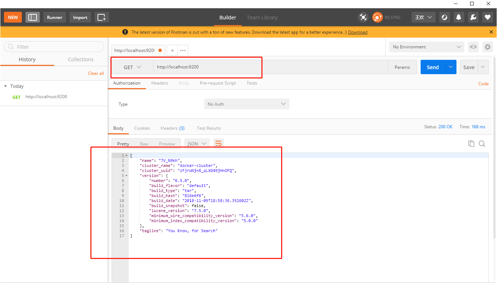
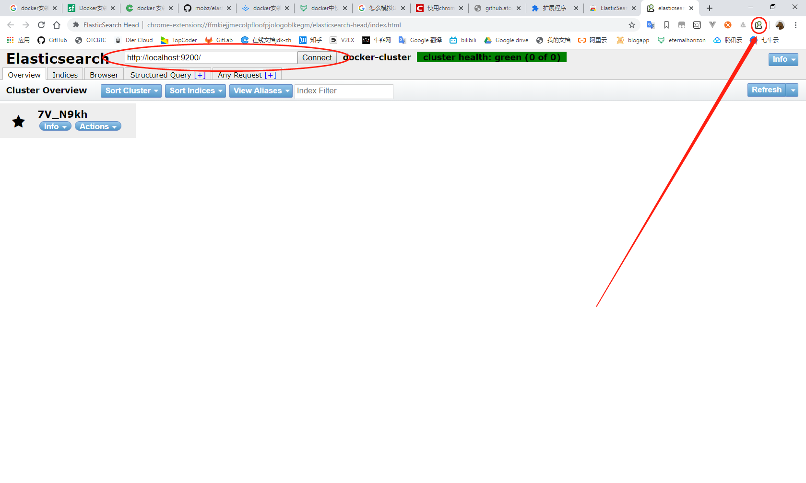

## 拉取镜像
```bash
docker pull elasticsearch:6.5.0
docker images
```
<!--more-->
## 启动容器
```bash
docker run -d  -p 9300:9300 -p 9200:9200 -p 5601:5601 --name elasticsearch -v D:/elasticsearchdata:/data elasticsearch:6.5.0

docker ps
```

## 查看日志
```bash
docker logs -f 91fe
```

## 谷歌浏览器安装elasticsearch head插件
