## 整体框架


+ 首先监测Backup文件夹，由于公司lab环境和office环境ping不通，我利用我在公司个人文件夹，监测Backup文件夹，当有新的文件传入，会复制到我的个人文件夹data内。
<!--more-->
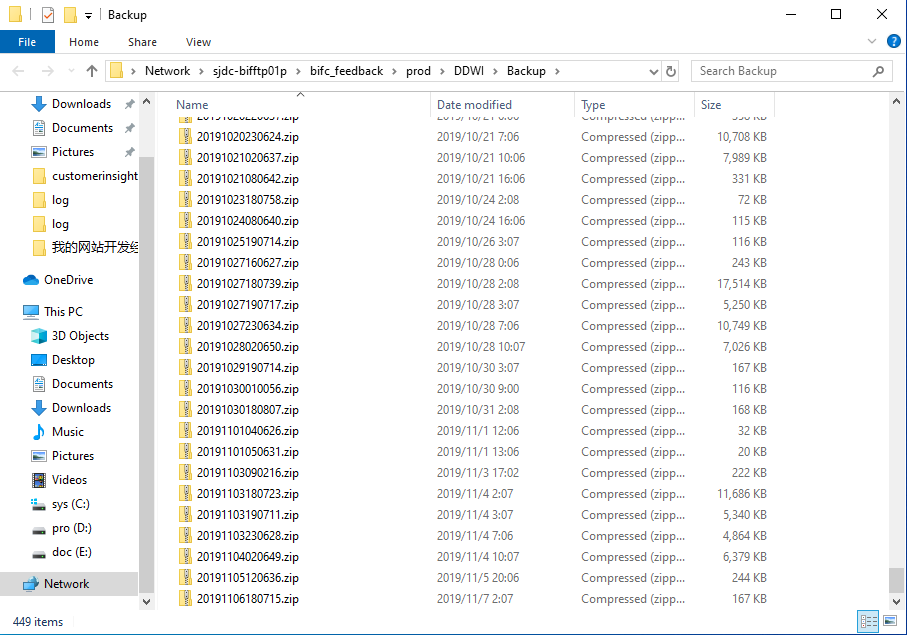


+ 同样原理，这时就可以进入lab环境开发，由于我一开始在windows上写的Java代码，所以是在windows上进行解压缩，解析，以及发送解析后的json文件到elasticsearch所在的centos服务器上，其实没必要这样，建议后面改为解压缩解析都在centos服务器上，当然更好的是在获得源文件时不需要压缩直接解析上传至elasticsearch.

+ 我在Centos服务器上写了个脚本，当有json文件上传至服务器，就上传到elasticsearch

## Java代码后期只需要修改配置文件即可

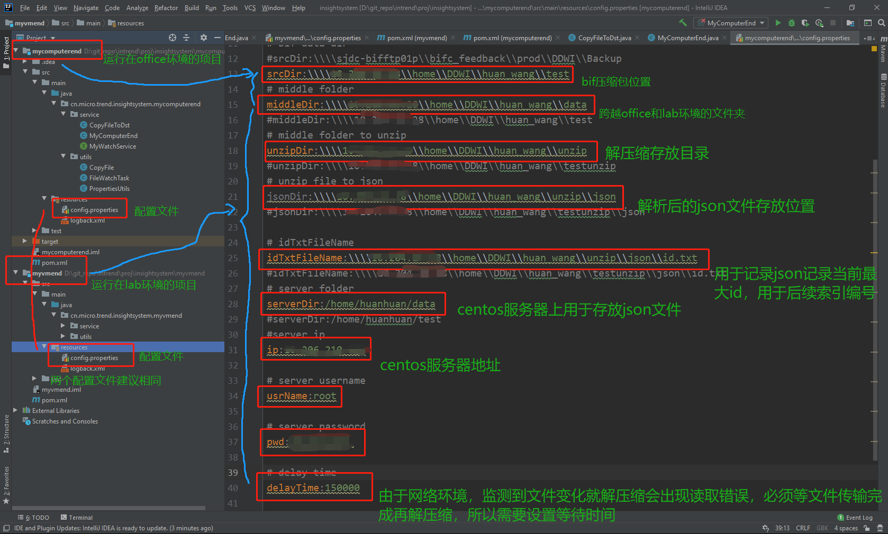

## ElasticSearch

关于elk安装配置，在windows上总是会出现各种问题，这里我完全参考了这个[教程](https://www.howtoing.com/how-to-install-elasticsearch-logstash-and-kibana-elastic-stack-on-centos-7)在centos下进行安装配置。大家也可以跟着教程安装配置。

此次项目，我建立的索引如下：
```bash
curl -X PUT "localhost:9200/acinfoindex?pretty" -H 'Content-Type: application/json' -d'
{
  "mappings":{
    "info":{
      "properties":{
        "AC":{"type":"keyword"},
        "GUID":{"type":"keyword"},
        "TIME":{"type":"date",
          "format": "epoch_second"
          },
        "CPUINFO":{
            "properties":{
                "auth_simp_n":{"type": "integer"},
                "auth_ntlm_n":{"type": "integer"},
                "th_inc":{"type": "integer"},
                "th_net_in_traffic":{"type": "integer"},
                "auth_krb5_n":{"type": "integer"},
                "usg_mem":{"type": "integer"},
                "th_net_out_traffic":{"type": "integer"},
                "auth_succ_n":{"type": "integer"},
                "usg_disk_io":{"type": "integer"},
                "th_inc_http2":{"type": "integer"},
                "th_inc_https":{"type": "integer"},
                "th_inc_http":{"type": "integer"},
                "auth_n":{"type": "integer"},
                "usg_cpu":{"type": "integer"}
            }
            
        } 
    }
    }   
  }
}
'
```

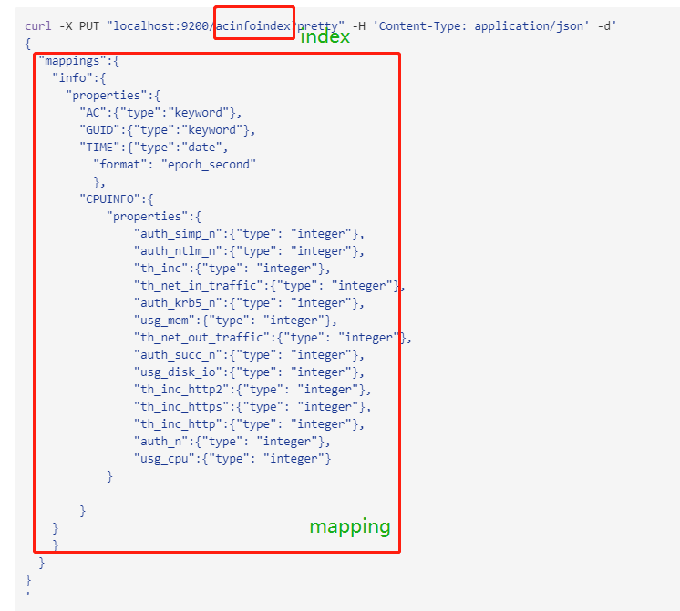

## 上传数据至elasticsearch
```python
import os
import pyinotify

multi_event=pyinotify.IN_CREATE|pyinotify.IN_ACCESS|pyinotify.IN_CLOSE_WRITE
wm=pyinotify.WatchManager()

class MyEventHandler(pyinotify.ProcessEvent):
    def process_IN_CREATE(self,event):
        print('CREATE',event.pathname)
    def precess_IN_ACCESS(self,event):
        print('ACCESS',event.pathname)
    def process_IN_CLOSE_WRITE(self,event):
        print('CLOSE_WRITE',event.pathname)
        output = os.popen("curl -H 'Content-Type: application/x-ndjson' -XPOST 'localhost:9200/acinfoindex/info/_bulk?pretty' --data-binary @"+event.pathname)

handler=MyEventHandler()

notifier=pyinotify.Notifier(wm,handler)

wm.add_watch('/home/huanhuan/data',multi_event)
notifier.loop()
```
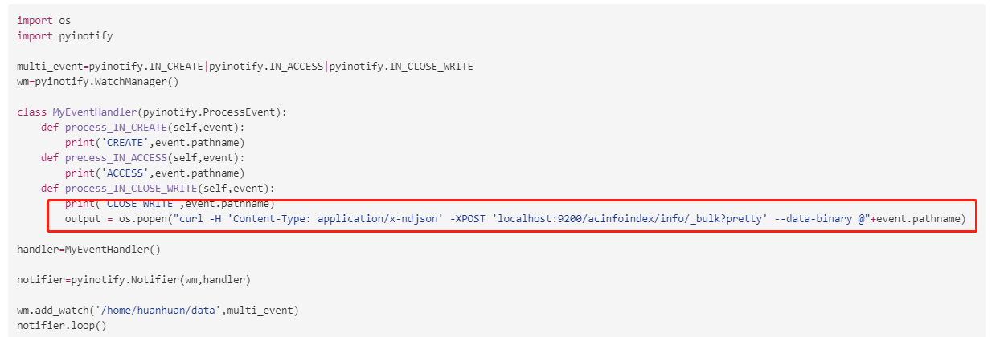

## 如何在Kibana上查看我们上传的数据

> 查看数据是否上传成功
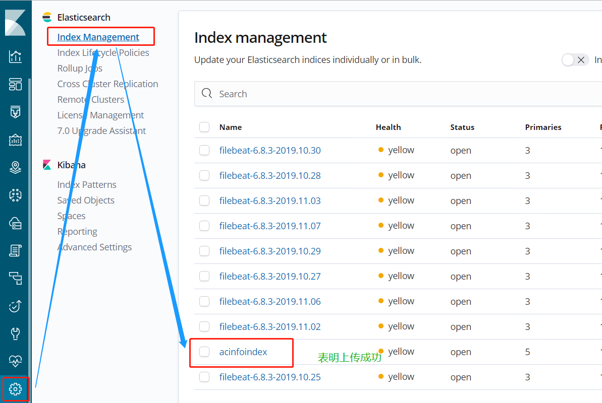

> 建立Index Pattern
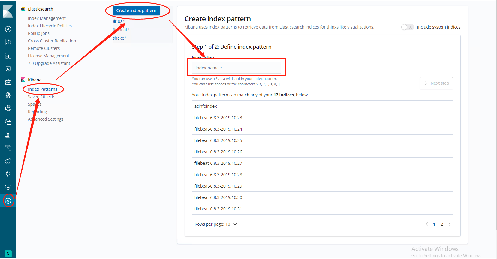
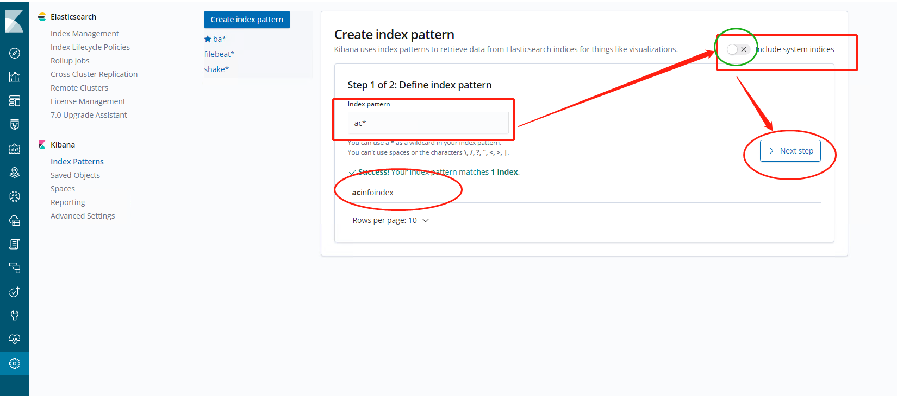
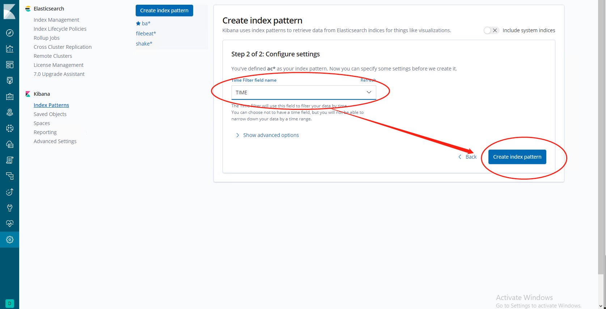

> Discover中查看数据，大家以后检验数据是否正确，可以在这里搜索查看。
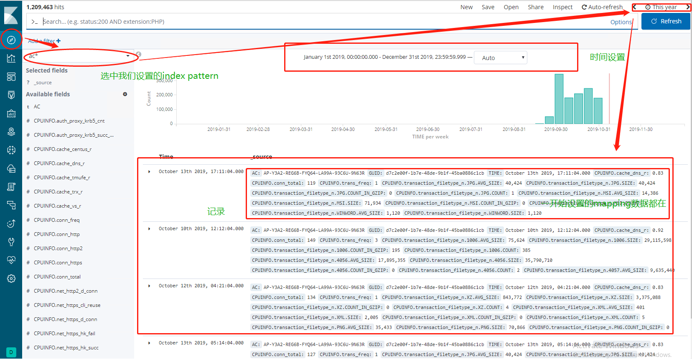

## grafana
[安装教程](https://www.aiprose.com/blog/26)

[官方教程](http://docs.flycloud.me/docs/ELKStack/elasticsearch/other/grafana.html)

### 添加datasource

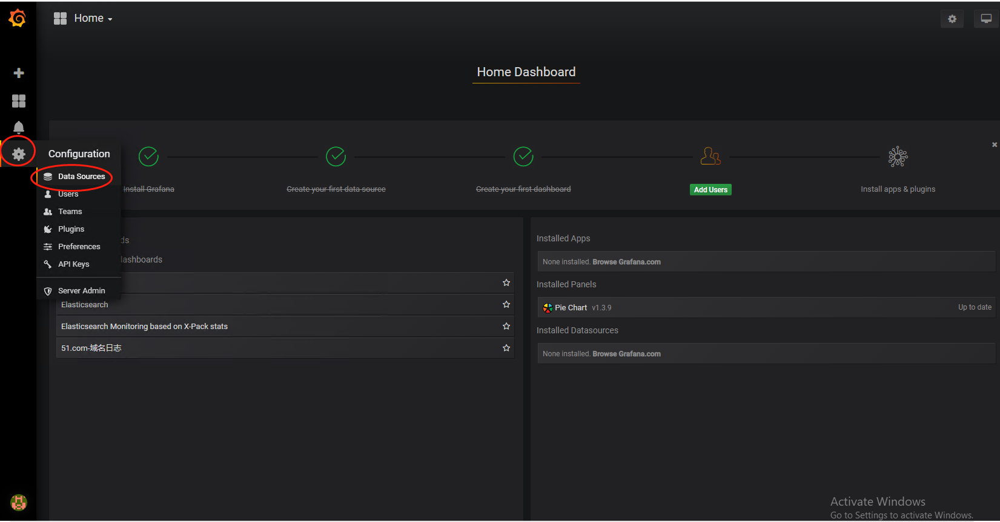

具体添加elasticsearch就不赘述了,[教程](http://docs.flycloud.me/docs/ELKStack/elasticsearch/other/grafana.html)中有。

### 怎么在table中添加全局变量
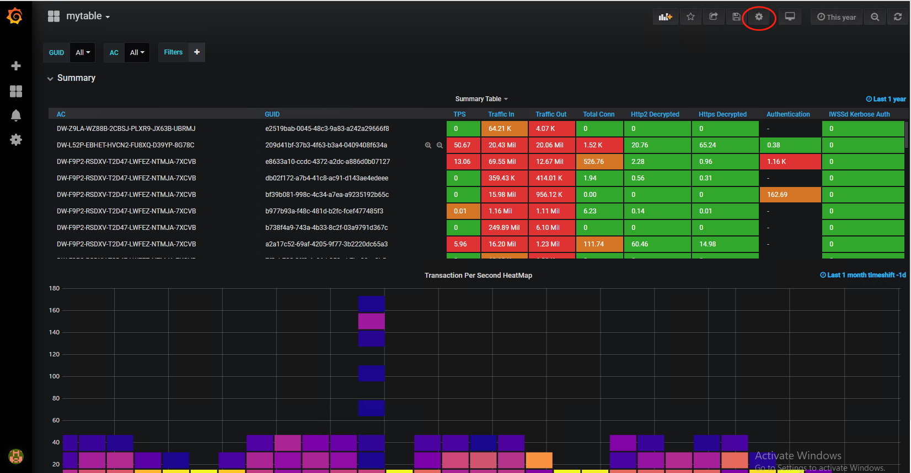
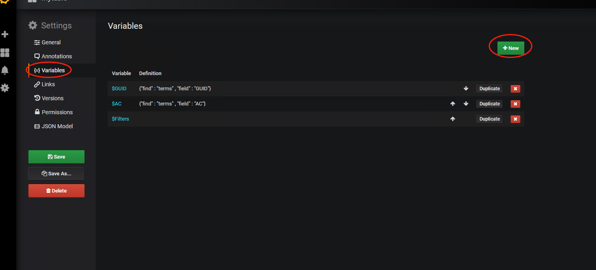
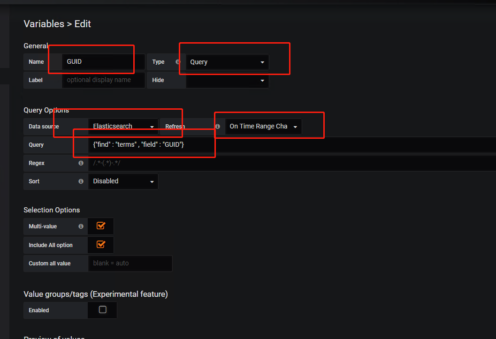
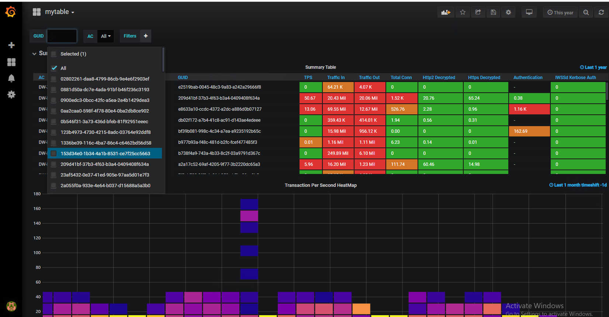

### 怎么添加一个graph等等
参考[教程](http://docs.flycloud.me/docs/ELKStack/elasticsearch/other/grafana.html)。

> table
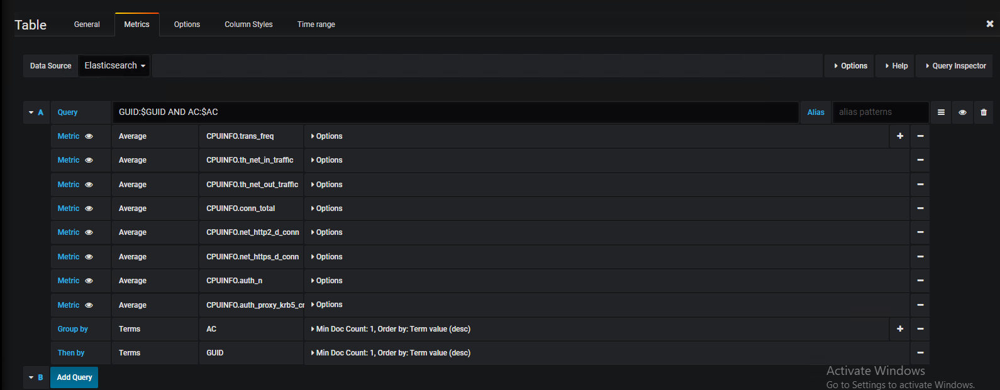
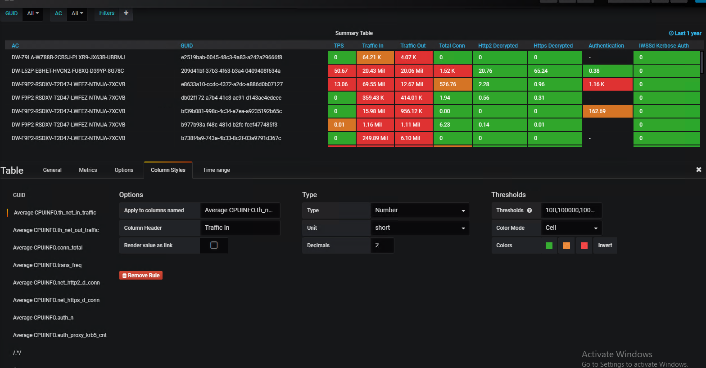

> graph
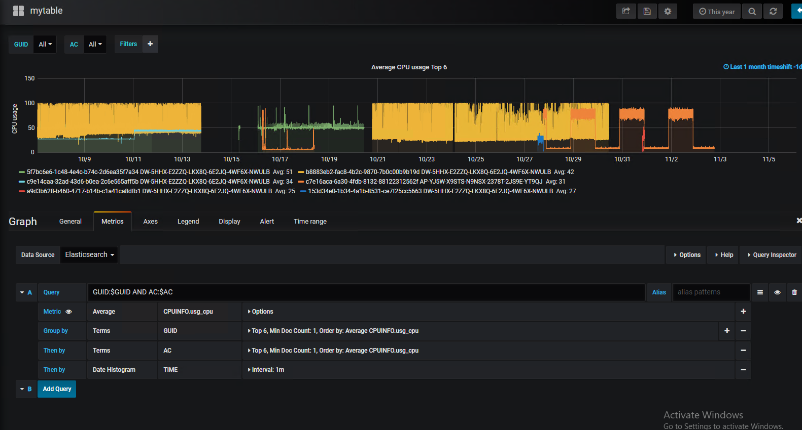
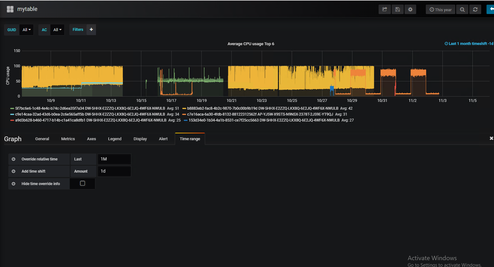