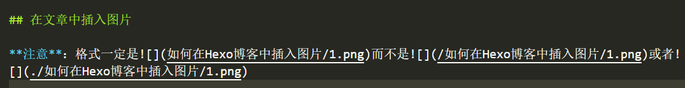

在hexo博客中插入图片有好几种方法，但本着markdown语言所见即所得的原则，本文选择一种插件方式来显示图片。由于hexo在生成页面时会对文件路径前加入时间，所以直接使用markdown插入图片的方式是不可行的。

参考大佬的插件：https://github.com/CodeFalling/hexo-asset-image, 可以使用markdown插入图片的方式，这样可以本地预览也可以在网页浏览。

## 安装依赖

```bash
npm install  https://github.com/CodeFalling/hexo-asset-image --save
```

## 设置_config.yml
```yml
post_asset_folder: true
```

## 在文章中插入图片

**注意**：



