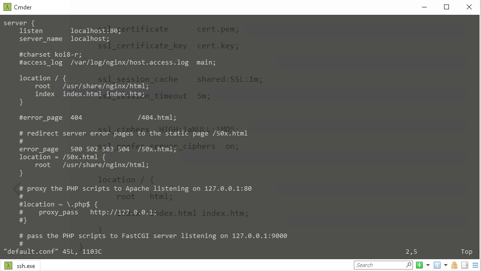
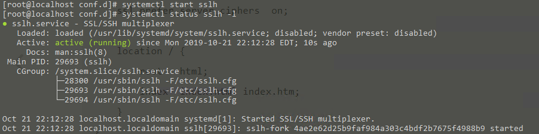

## 什么是SSLH
一种不同的multiplexing在相同端口处理多种协议，sslh就是这样可以处理ssl和ssh。sslh可以分辨进入端口的是哪种协议，并转发到相应的服务。这样就可以在同一个端口同时处理http和ssh。注意，这个方法并不是掩藏实际的ssh服务，扫描监听端口的工具scanssh依然可以监听到ssh。**sslh方法可以在防火墙开放较少的端口情况下提供更多的服务。**


## 基本步骤：

+ 首先安装web服务器(tomcat, nginx etc.)，使之监听在localhost(default port 80), 当然也可以监听在非标准端口如8088
+ 设置ssh服务端口22的连接，这个端口也可以是任意的，但标准的是22
+ (optional)创建一个非特权用户 如sslh
+ 安装和启动sslh服务，并监听在端口443，并转发到localhost的http和ssh
   ```bash
    /usr/local/sbin/sslh-fork -u sslh -p xx.yy.zz.aa:443 --tls 127.0.0.1:2443 --ssh 127.0.0.1:22
   ```
   这个ip xx.yy.zz.aa是该服务器的外网ip，如我的10.206.210.235

## Centos上配置全过程

**在一切开始前请确认服务器的443端口是否对外开放**

### 安装nginx
```bash
yum install nginx
```
或者使用 [OpenResty(定制的nginx)](https://openresty.org/cn/)

创建证书：
```bash
cd /etc/nginx
openssl genrsa -out cert.key 2048
openssl req -new -x509 -key cert.key -out cert.pem -days 3650
```
配置nginx:
```bash
cd /etc/nginx/conf.d
ls
```
 + 修改default.conf localhost:80
   
 + 新建sslh.conf
 ```bash
 vim sslh.conf
 server {
    listen       localhost:443 ssl;
    server_name  localhost;

    ssl_certificate      cert.pem;
    ssl_certificate_key  cert.key;

    ssl_session_cache    shared:SSL:1m;
    ssl_session_timeout  5m;

    ssl_ciphers  HIGH:!aNULL:!MD5;
    ssl_prefer_server_ciphers  on;

    location / {
        root   html;
        index  index.html index.htm;
    }
}
 ```

 启动nginx, 并监听端口443
 ```bash
 netstat -an | grep 443
 ```
 会看到
 ```bash
 tcp        0      0 127.0.0.1:443           0.0.0.0:*               LISTEN
 ```
 表明nginx启动成功，当然你也可以用下面命令查看nginx启动状态
 ```bash
 systemctl status nginx -l 
 ```

 ### 安装sslh

 ```bash
sudo yum install epel-release
sudo yum install sslh
 ```
>这个安装包位于EPEL，所以需要先安装EPEL软件仓库

>EPEL中，这个sslh配置已经非常完善，配置文件 /etc/sslh.cfg

修改/etc/sslh.cfg，只需要修改 { host: "SERVER_NAME"; port: "443"; }，这个SERVER_NAME对应的是/etc/hosts中服务器外网的IP地址解析

```conf
# This is a basic configuration file that should provide
# sensible values for "standard" setup.

verbose: false;
foreground: true;
inetd: false;
numeric: false;
transparent: false;
timeout: "2";
user: "sslh";


# Change hostname with your external address name.
listen:
(
    { host: "10.206.210.235"; port: "443"; }
);

protocols:
(
     { name: "ssh"; service: "ssh"; host: "localhost"; port: "22"; probe: "builtin"; },
     { name: "openvpn"; host: "localhost"; port: "1194"; probe: "builtin"; },
     { name: "xmpp"; host: "localhost"; port: "5222"; probe: "builtin"; },
     { name: "http"; host: "localhost"; port: "80"; probe: "builtin"; },
     { name: "ssl"; host: "localhost"; port: "443"; probe: "builtin"; },
     { name: "anyprot"; host: "localhost"; port: "443"; probe: "builtin"; }
);
```
现在我们准备在443端口上启动sslh，提供HTTPS和SSH的协议转发
```bash
systemctl start sslh
systemctl status sslh -l
```


### 验证
在另一台可以ping到该服务器的机器上
```bash
ssh 10.206.210.235 -p 443
```

浏览器访问：
>https://10.206.210.235加密通道

>http://10.206.210.235:443非加密通道

验证了sslh确实在443端口提供了多种服务。

## 参考

+ https://huataihuang.gitbooks.io/cloud-atlas/service/ssh/sslh_multi_service_in_one_port.html

 


