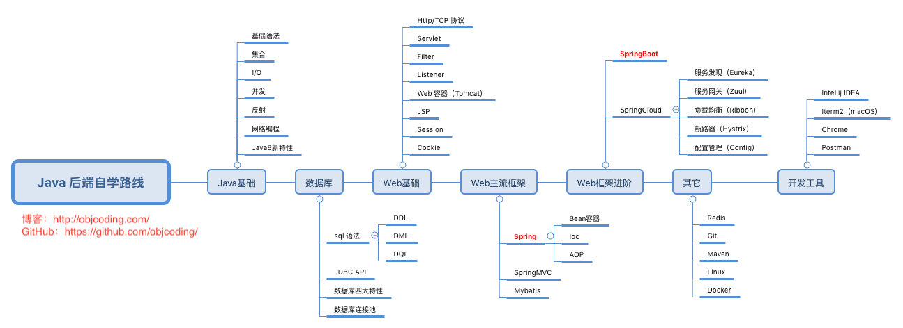
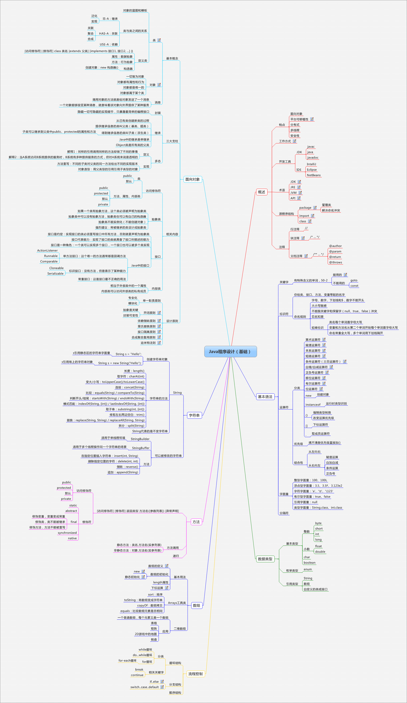

## 网站介绍

### 功能介绍

http://www.seumstc.top:8090/index.html

### 什么是前后端分离的开发模式

**Web研发模式演变：**https://github.com/lifesinger/blog/issues/184

### 开发这样一个网站我们需要的技术栈

## Java学习历程

学习资源：
> https://github.com/Snailclimb/JavaGuide
>
> https://github.com/CL0610/Java-concurrency

### Java基础

**书本推荐：**《Java核心技术》《Java编程思想》 建议先看核心技术

Java作为一门强类型语言，我们学习Java需要首先明确**面向对象**的概念，可以理解以下几个概念：**封装、继承、多态**等，并学会灵活运用。此外还可以学习一些Java语言特性，如泛型、反射等。这些特性广泛运用于一些框架中，如Spring的Aop和Ioc均使用了Java的反射特性，然而我们知道，原生Java反射效率不高，具体原因我们后面专门写博客分析。

其次，就是要学习一些Java的标准库，如集合、IO、String等等.

学习中可以采用这样一个模式：
+ 理解概念
+ 找相关demo学习
+ 动手复现
+ 总结：效率、扩展性等方面

### 数据结构、基础算法与设计模式

**推荐书籍：**《剑指Offer》《修炼Java开发技术》《Effective Java》

数据结构的学习是学任何一门编程语言的基础，在学完基础语法以后就需要深入学习数据结构。只要掌握好数据结构才能结合算法写出效率与鲁棒性俱佳的代码。

对于这部分的学习，没有更多方法就是多刷题，多总结。我后续会在博客网站写相关内容。

### JVM以及操作系统
**推荐书籍：** 《深入理解Java虚拟机》

**一定要看**，重点关注JMM(Java内存模型)，GC，还需要了解一些Java虚拟机指令，方便调试。

### 数据库
这部分我没有书籍推荐，我个人觉得是要自己安装并使用才是最重要的。

对于数据库你需要理解
> 什么是关系型数据库(Mysql, Orcal sql etc.)及其优缺点

> 什么是非关系型数据库(Redis, MongoDB etc.)及其优缺点

> Sql与NoSql的应用场景

> 数据库运维基础

> 对于关系型数据库，怎么提升其性能

> 非关系数据库的备份与同步问题

> Java操作数据库的API(如对于Mysql的Mybatis，对于Redis的Jedis)
### 框架学习

**推荐书籍：** 《Spring实战》《Springboot 实战》
Java的一大优势就是拥有很多优秀的开源与非开源的框架。

但是首推自然是Spring全家桶。

同样，对于一个框架学习，需要抓住切入点，可以从以下方面展开学习：

> Spring是什么？它有什么优点？

> 什么IOC(依赖注入或者控制反转)？

> 什么是AOP(面向切片编程)？

> Spring的结构是怎样的？

> Spring中涉及的设计模式

### 计算机网络与Web基础

**推荐书籍：**《深入理解计算机网络》

参考连接：https://github.com/Snailclimb/JavaGuide/blob/master/docs/network/%E5%B9%B2%E8%B4%A7%EF%BC%9A%E8%AE%A1%E7%AE%97%E6%9C%BA%E7%BD%91%E7%BB%9C%E7%9F%A5%E8%AF%86%E6%80%BB%E7%BB%93.md

这部分的学习，需要系统性的学习，从网络基础的TCP协议到HTTP协议或SSH服务协议等，理解网络分层模型。

### 一些工具
 + git
 + docker
 + nginx
 + ...
  
### 前端基础

> 三件套HTML、JavaScript、CSS基础

> 利用一些框架如React、Angular、Vue等实现一些简单的前端交互界面。

### 中间件

> 什么是中间件

目前，它并没有很严格的定义，但是普遍接受IDC的定义：中间件是一种独立的系统软件服务程序，分布式应用软件借助这种软件在不同的技术之间共享资源，中间件位于客户机服务器的操作系统之上，管理计算资源和网络通信。从这个意义上可以用一个等式来表示中间件：中间件=平台+通信，这也就限定了只有用于分布式系统中才能叫中间件，同时也把它与支撑软件和实用软件区分开来。

> 中间件分类

+ 底层中间件: 用于支撑单个应用系统或解决单一类问题
  - 事务处理中间件(TPM)
  - 应用服务器(WAS)
  - 消息中间件(MOM)
  - 数据访问中间件(UDA)
  - ...
+ 高层中间件: 用于系统整合
  - 企业应用集成中间件(EAI Suites)
  - 工作流中间件(Workflow)
  - 门户中间件(Portal)
  - ...

### 一些测试框架

**不懂测试的开发不是好的开发**

### 学无止境，寻找Java替代品

大家在学习一门语言要想想这门语言的短处在哪？

建议大家在学习之余，不管你是做算法还是开发，都要努力提升自己的编程能力，推荐学习Nodejs和Golang。
